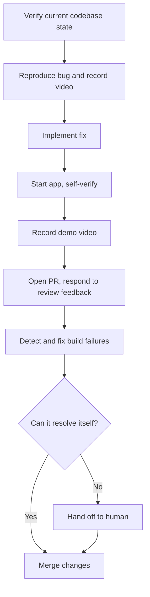

[Part 1](/en/posts/tech/2026-04-24-harness-engineering) laid out the **concept** of Harness Engineering: an AI Agent = language model + Harness, and when an Agent underperforms, the problem isn't necessarily the model — it may just be a poorly designed harness.

But concepts are one thing. What does "designing the harness" actually look like? What do engineers concretely do? This post starts with a real, scaled-up experiment and examines what Harness Engineering looks like in a production environment.

## An experiment designed to be extreme

In February 2026, OpenAI published a blog post titled "Harness engineering: leveraging Codex in an agent-first world." It's a process log of building an internal product from scratch using Codex Agent.

The rules were set to be extreme on purpose: **no human is allowed to write a single line of code**. Application logic, tests, CI config, API docs, internal tooling, observability stack — all produced autonomously by Codex. Engineers did exactly one thing: design the agent's working environment.

Five months later, the numbers look roughly like this:

| Metric | Data |
|--------|------|
| Development window | 5 months |
| Starting team | 3 engineers |
| Later team | 7 engineers |
| Code volume | ~1M lines |
| Human-written code | **0 lines** |
| PRs merged | ~1,500 |
| PRs per person per day | 3.5 |
| Efficiency vs. traditional | ~10x |

A three-person team, each merging 3.5 PRs per day, finishing in five months what would traditionally require 20–30 engineers.

Looking at the numbers alone easily turns this into an arms race, but what really deserves attention is **the counterintuitive phenomena that showed up during the process** — and how OpenAI used engineering means to suppress them.

### Why doesn't adding people slow things down?

Here's the first counterintuitive point. When the team expanded from 3 to 7, throughput **didn't drop** — it kept increasing. This directly violates one of software engineering's most famous laws — **Brooks's Law**: "Adding manpower to a late software project makes it later."

The root of Brooks's Law is communication cost. In traditional development, every added person creates N-1 more communication channels; behind each channel is code-level coupling — "the interface I wrote and the way you call it need to align," "I changed the schema and need to tell you." More people, more noise.

The reason Harness Engineering can sidestep this law is that **the coupling point has moved**:

- **Traditional development**: coupling lives between "my code" and "your code"
- **Harness development**: coupling lives between "the environment constraints I designed" and "the environment constraints you designed"

Environment-constraint coupling is naturally sparser than code coupling — everyone is editing rules and docs, not the same `user_service.py`. The marginal cost of adding people is much lower. This also explains why OpenAI dared to expand later: an extra engineer contributes not 3.5 PRs of execution, but 3.5 PRs of **environment design capacity**.

### Why doesn't the Agent naturally collapse?

The second counterintuitive point is more critical. One million lines of code, all produced by a statistical model with no memory, no taste, and reading its context from scratch every time — in theory this should be a disaster: style drift, reinvented wheels, accumulating random tech debt.

Agents do have this tendency. OpenAI's team found that left unattended, Codex might implement the same feature three different ways, log in five different formats, write tests in wildly varying styles. But rather than resorting to "fix it with human Review" — impossible at 3.5 PRs per person per day — they asked a more fundamental question:

> **What capabilities (tools, abstractions) are needed, and how do we make them legible to the Agent?**

This question is the **thinking origin** of the entire Harness Engineering methodology. It pulls engineers out of the bottomless pit of "let's try harder to coach the Agent" and replaces it with an actionable engineering question: **What's missing in your environment such that the Agent can't converge to the right direction on its own?**

Follow that question, and five engineering practices naturally emerge.

---

## Practice 1: Make the App Legible to the Agent (Application Legibility)

### The problem

An Agent can write JSX correctly, but it can't tell whether the rendered button is misaligned, the color is wrong, or the click feels laggy. It can write API handlers, but it can't see the latency or the occasional 500 when the handler runs.

In traditional development, this is human work — an engineer opens the browser and eyeballs it, QA clicks through manually, issues surface later. But if an Agent runs hundreds of tasks a day and a single task might span 6+ hours, "human eyeballs" can't keep up.

More critically: **if the Agent can't see the effects of its own output, it doesn't know it made a mistake, and has no way to self-correct.** No observation, no feedback. No feedback, no convergence.

### The solution

OpenAI let the Agent "grow eyes" of its own by doing three things:

**Git Worktree integration.** Every time Codex needs to verify a change, it can spin up a full application instance in an isolated worktree, without stepping on other in-flight PRs. This turns "run it and see" into an atomic operation — the Agent doesn't need to compete with other tasks for the environment.

**Wire up Chrome DevTools Protocol (CDP).** Codex gets browser control — it can screenshot, read DOM snapshots, simulate clicks, and simulate navigation. From this moment on, the Agent isn't just writing UI code; it can open the page to confirm rendering, reproduce user-reported bugs itself, and attach demo videos to the PR.

**Local observability stack.** A full logs + metrics system is deployed. The Agent can query logs with LogQL and metrics with PromQL. When something breaks, it doesn't wait for a human to tell it — it reads the trace itself.

Stack the three capabilities together, and the Agent's workflow shifts from "blindly write code and hand it to a human" to a complete loop:

```
Write code → Run it → See the result (screenshot / logs / metrics)
   → Notice something's off → Fix it → Run again
```

This is the prerequisite for Codex being able to **work on a single task for over 6 hours continuously**. It usually happens while humans sleep — engineers dispatch tasks at night, collect PRs in the morning. Without Application Legibility, this kind of asynchronous collaboration would be impossible.

### The takeaway for teams that aren't OpenAI

Most teams don't have Codex, but the core of this practice transfers: **for any task you want an Agent to complete autonomously, first ask "can the Agent see the outcome of this task?"** If the answer is no, no matter how good your prompt is, the Agent will remain stuck in blind-write mode.

Wiring the Agent to a Puppeteer MCP, giving it an environment where it can curl a health-check endpoint, granting it permission to read log files — these all count as minimum viable versions of Application Legibility.

---

## Practice 2: The Repo as Single Source of Truth (Repo as Record)

### The problem

Agents have no memory. Every new session, its understanding of the project starts from zero. The naive instinct is: just write an ultra-long AGENTS.md and cram architecture, conventions, decisions, history all in there, so the Agent absorbs it at the opening of every session.

OpenAI explicitly rejected this. They tried it. It performed poorly. Three reasons:

1. **Context crowding.** A multi-thousand-line instruction file consumes a huge chunk of the context window, leaving less room for "actual work." Combined with the sweet spot mentioned in the previous post, an oversized AGENTS.md pushes the Agent straight into the Dumb Zone.
2. **Docs rot.** Code changes; instruction files don't get maintained. Three months later, what the doc says and what the repo actually looks like no longer match, and the Agent gets misled by reading it.
3. **Hard to verify compliance.** How do you confirm the Agent actually followed the rules in the doc? There's no mechanism to guarantee it.

### The solution: map mode

OpenAI's alternative treats AGENTS.md as a **map**, not an **encyclopedia**. The whole file is about 100 lines and does one thing: tells the Agent "if you want X information, look in Y directory."

```
AGENTS.md (~100 lines)
├── Project overview: one sentence describing what this is
├── Architecture entry: points to docs/architecture/
├── Design docs: points to docs/design/
├── Coding conventions: points to docs/conventions/
├── Execution plans: points to docs/plans/
└── References: points to docs/reference/
```

Specific knowledge lives in a structured `docs/` directory, with each category having a clear update cadence and stability level:

| Type | Content | Characteristic |
|------|---------|----------------|
| Architecture docs | System architecture, module boundaries | Stable, rarely changes |
| Design docs | Design proposal per feature | Has status (Draft / Approved / Implemented) |
| Execution plans | Current sprint task list | Frequently updated |
| Product specs | Feature requirements and acceptance criteria | Synced with PM |
| Reference docs | API contracts, error codes, data models | Auto-generated |

This pattern is called **Progressive Disclosure**: the Agent starts from a stable entry point and pulls in information on demand, rather than being drowned in a wall of instructions upfront.

### A self-referential maintenance mechanism

There's one detail worth calling out separately. OpenAI runs a **doc-gardening Agent** on a schedule, dedicated to scanning and cleaning up stale docs — comparing docs against actual code, finding out-of-date sections, and producing update PRs.

This is a self-referential system: **using an Agent to maintain the docs that other Agents read.** Its significance is putting the docs themselves into the "mechanized execution" loop, rather than relying on human diligence to update them. This is a recurring pattern in Harness Engineering: **automate whatever maintenance you can, or the system will rot**.

---

## Practice 3: Replace Code Review with Architectural Constraints

### The problem

One million lines of code, five months, 3.5 PRs per day. Maintaining style consistency the traditional way — Code Review — is impossible. The manpower arithmetic simply doesn't work.

But a codebase without Review becomes a junkyard fast. So OpenAI flipped the approach: **don't rely on review, rely on constraints**. Let the Agent only run inside a fixed "lane" — if it drifts, CI blocks it directly.

### Means 1: Strict layered architecture

Each business domain is forced into six layers, with dependencies strictly one-way:

```
Types → Config → Repo → Service → Runtime → UI
```

Upper layers may reference lower layers; the reverse is forbidden. If the Agent writes UI code that directly calls the Repo layer, CI turns red and the PR can't merge.

This level of strictness is hard to enforce on human teams — someone always says "let me bend it just this once, I'll clean up later." But **the Agent doesn't complain, doesn't cut corners, doesn't make verbal promises to pay down tech debt**. If CI fails, it fixes; if it still fails, it fixes again. This is a unique advantage Agents have over humans: **their tolerance for mechanical constraints is infinite**.

### Means 2: Providers pattern

Cross-cutting concerns (auth, telemetry, logging, error handling) aren't allowed to be `import`ed ad hoc — they can only be injected through a unified Provider interface:

```typescript
// ✅ Correct
const auth = useProvider('auth');

// ❌ Wrong
import { getSession } from '../auth/session';
```

This ensures each cross-cutting concern has a **single entry point**. Without this constraint, the Agent would end up producing five different auth-handling styles across modules — because each time it starts from scratch and reinvents.

### Means 3: Custom linters, where error messages are prompts

This is the single highest-leverage insight in Harness Engineering. It deserves standalone emphasis.

OpenAI had Codex generate a suite of custom linters — enforcing structured logging, naming conventions, file size limits, cross-layer dependency bans, etc. But the key point is that **every linter error message directly contains the fix instruction**:

```
ERROR: File exceeds 300 lines limit.
FIX: Split into smaller modules. Move helper functions to utils/.
     See docs/conventions/file-size.md for guidelines.
```

When the Agent hits this error, it doesn't need any extra context — it knows how to fix it. **Every linter rule you write is, in essence, an auto-triggered prompt.**

If you internalize this observation, a lot of things change. Traditionally, linters are "tell the human what's wrong" tools — the shorter the message the better, since humans go look things up themselves. But in an Agent-first world, linters become "teach the Agent to do the right thing" tools — the more specific and how-to-flavored the message, the lower the Agent's fix cost.

**The linter upgrades from a validation tool to a teaching tool** — a shift you rarely see in traditional software engineering.

---

## Practice 4: High Throughput Rewrites the Merge Philosophy

### The problem

When Agent output speed vastly exceeds human review capacity, the traditional PR flow becomes the bottleneck. Write code → open PR → wait for Review → fix → wait again → merge; the full lifecycle can be two or three days. At 3.5 PRs per day per Agent, a 2–3 day PR cycle makes the backlog grow exponentially.

### The core logic shift

OpenAI's response is blunt: **lower the merge threshold, accept a higher correction frequency**.

The cost calculation behind this has changed:

> In a system where Agent output vastly exceeds human attention, **the cost of waiting is higher than the cost of correcting**.

Concrete practices:

- **Shorten PR lifecycle**: all automated tests pass + CI green = mergeable. No unnecessary human blocking gates.
- **Flaky tests don't block**: reruns solve them, don't indefinitely block merges.
- **Fast rollback beats strict review**: if something breaks, open a follow-up PR to fix, rather than trying to prevent every possible issue before merge.

This resembles Google's Trunk-Based Development, but more extreme — because the "author" of the code is a callable-anytime Agent, **the marginal cost of a fix is nearly zero**. The traditional "think twice before merging" caution exists because fixing bugs consumes precious human engineering time. When that cost trends to zero, the optimum for merge policy shifts accordingly.

### This isn't "lowering quality" — it's a different quality assurance strategy

It's easy to misread this as "OpenAI trading quality for speed." That's not what's happening. Quality assurance has been moved from **human review before merge** to **mechanical checks before merge (CI + linters + architectural constraints) + fast rollback after merge**. The former is a gate; the latter is a loop. They chose the loop because loops scale. Gates don't.

---

## Practice 5: Background Cleanup, Fighting Entropy

### The problem

Fully autonomous Agents introduce "drift." Over time, the codebase accumulates inconsistent styles, redundant utility functions, stale comments, duplicate implementations — this isn't a bug, it's entropy. Like an untended house: nothing broke, but the whole thing gets messier over time.

Agent-generated code is worse on this front than human-written code. **LLMs have a tendency to reinvent the wheel every time**, because they don't proactively search "has this utility already been written?" Anthropic assigned a dedicated "dedup Agent" in their C compiler project precisely because of how often this happens.

### The solution: translate subjective taste into mechanical rules + background cleanup

OpenAI works in two steps.

Step one: **translate subjective code taste into mechanically executable rules**:

| Subjective rule | Mechanized translation |
|-----------------|------------------------|
| "Code should be concise" | Single function ≤ 30 lines |
| "Don't reinvent the wheel" | Prefer existing tools in `shared/utils/` |
| "Names should be meaningful" | Function names start with verbs, variable names are noun phrases |
| "Error handling should be standardized" | All errors must be reported via ErrorProvider |

Subjective rules can't be validated by CI; mechanized rules can. One of the core ongoing tasks in Harness Engineering is: **continuously translating the former into the latter**.

Step two: periodically run dedicated **background cleanup Agents** — scan for spots drifting from convention → produce refactor PRs → automatically run tests to verify refactor safety → submit for review. These Agents don't write new features; they clean up.

OpenAI used a memorable analogy:

> Tech debt is like a high-interest loan — you should make small, frequent payments rather than accumulating and paying painfully later.

The traditional team's approach is "let it slide, we'll do a big refactor when we have time" — and "when we have time" never comes. The Harness approach automates "paying it down" into a daily background task, so the debt never accumulates to the point where a major refactor becomes necessary.

---

## End-to-End Autonomous Flow: Agent from Tool to Colleague

Stack the five practices together, and OpenAI implemented a complete end-to-end autonomous feature development flow:



Note the second-to-last step: "**Hand off to human only when necessary**." Humans aren't reviewers of every PR — they're the safety net when the Agent gets stuck.

If you covered up the "author" field, you'd have a hard time telling this flow apart from a senior engineer's daily work.

---

## The real shift: discipline has moved

Looking back at the five practices, you'll notice a common thread: none of them are "make the Agent smarter" tricks. They're "make the environment better at hosting the Agent" designs. The engineer's center of gravity has fundamentally shifted.

OpenAI's blog post ends with a line worth writing down:

> The discipline required in software engineering is no longer expressed in the code itself, but in the supporting structures, tools, abstractions, and feedback loops.

Previously, "a disciplined engineer" meant: writes clean code, covers tests thoroughly, updates docs on time, writes clear PR descriptions. These are **individual-level** disciplines, transmitted and maintained through Code Review.

Now, "a disciplined engineer" means: designs tight architectural constraints, covers comprehensive linter rules, maintains fresh doc structures, closes feedback loops fast. These are **system-level** disciplines, realized through environment design.

**Code quality has moved from "personal virtue" to "system property"** — like how quality in a modern factory doesn't depend on how skilled a specific worker is, but on how precisely the production line is designed.

What does this shift mean for engineers' careers? Both a challenge and an opportunity. Those who truly understand "engineering" — rather than just being good at "coding" — become more valuable, not less. Because in a world where every Agent can write code, **"knowing what to write" and "knowing how to make sure it's written right" are the truly scarce skills**.

---

The concept and OpenAI's benchmark case are both clear now. The next question: **if I'm not OpenAI and I don't have Codex, how does this methodology land on my project?** [The next post](/en/posts/tech/2026-07-12-harness-engineering-3) shifts to an industry-wide lens: the four typical Agent failure modes, the 40% context sweet spot, the four-pillar framework that has emerged across teams, and a three-phase rollout roadmap from "start this afternoon" to "fully automated in two weeks."

## References

- [Harness engineering: leveraging Codex in an agent-first world (OpenAI)](https://openai.com/index/harness-engineering/)
- [Harness Engineering: When humans stop writing code (Zhihu)](https://zhuanlan.zhihu.com/p/2018034938402861798)
- [Harness Engineering deep dive (Meta / Zhihu)](https://zhuanlan.zhihu.com/p/2014014859164026634)
