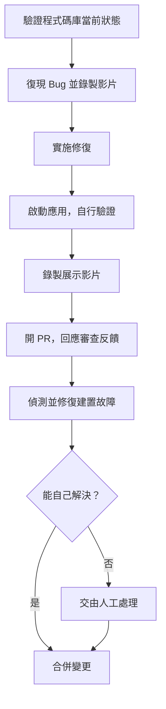

[上一篇](/posts/tech/2026-04-24-harness-engineering)講清楚了 Harness Engineering 的**概念**：AI Agent = 語言模型 + Harness，當 Agent 表現不佳時，問題不一定在模型，而可能在馬具設計得不夠好。

但概念歸概念，「設計馬具」到底長什麼樣子？工程師具體要做哪些事？這篇從 OpenAI 一個規模化的實驗開始，看 Harness Engineering 在真實生產環境中的具體形狀。

## 一場刻意極端的實驗

2026 年 2 月，OpenAI 發了一篇博文，標題叫〈Harness engineering: leveraging Codex in an agent-first world〉。內容是他們用 Codex Agent 從零打造一個內部產品的過程紀錄。

實驗的規則設定得非常極端：**人類不能寫任何一行程式碼**。應用邏輯、測試、CI 配置、API 文件、內部工具、可觀測性堆疊——通通由 Codex 自主產出。工程師只做一件事：設計 Agent 的工作環境。

五個月後，數字大概長這樣：

| 指標 | 數據 |
|------|------|
| 開發週期 | 5 個月 |
| 起始團隊 | 3 名工程師 |
| 後期團隊 | 7 名工程師 |
| 程式碼規模 | ~100 萬行 |
| 人工編寫的程式碼 | **0 行** |
| 合併的 PR 數 | ~1,500 個 |
| 人均日處理 PR | 3.5 個 |
| 相對於傳統開發 | 約 10 倍效率 |

3 個人的團隊，每天每人合併 3.5 個 PR，五個月完成傳統至少要 20-30 人團隊做的事。

單看數字容易變成軍備競賽，但這場實驗真正該被關注的是**過程中出現的反直覺現象**——以及 OpenAI 如何用工程手段把它壓下來。

### 為什麼加人不降速？

先看第一個反直覺點。團隊從 3 人擴到 7 人時，吞吐量**沒有下降**，反而繼續成長。這直接違反了軟體工程界最有名的定律之一——**布魯克斯法則（Brooks's Law）**：「向進度落後的軟體專案增加人手，只會使其更加落後。」

布魯克斯法則的根源是溝通成本。傳統開發中，每加一個人，就多出 N-1 條溝通管道；每個管道背後都是「我寫的介面和你呼叫的方式要對齊」、「我改了 schema 要通知你」這類程式碼層面的耦合。人越多，噪音越大。

Harness Engineering 之所以能繞開這個定律，關鍵在於**耦合點被搬家了**：

- **傳統開發**：耦合在「我的程式碼」和「你的程式碼」之間
- **Harness 開發**：耦合在「我設計的環境約束」和「你設計的環境約束」之間

環境約束的耦合天然比程式碼耦合稀疏——大家改的是規則和文件，不是同一份 `user_service.py`。加人的邊際成本因此低很多。這也解釋了為什麼 OpenAI 敢在後期擴編：多一個工程師，多的不是 3.5 個 PR 的執行力，而是 3.5 個 PR 的**環境設計能力**。

### 為什麼 Agent 不會自然崩潰？

第二個反直覺點更關鍵。100 萬行程式碼，全部由一個沒有記憶、沒有品味、每次都從零讀取上下文的統計模型寫出來——理論上應該是災難：風格漂移、重複造輪子、隨機技術債累積。

Agent 確實有這個傾向。OpenAI 團隊發現，如果放任不管，同一個功能 Codex 可能用三種不同方式實作，日誌格式五花八門，測試風格各異。但他們沒有選擇「靠人工 Review 修正」——一天 3.5 個 PR 的節奏下，人工 Review 會直接崩潰——而是問了一個更根本的問題：

> **究竟需要什麼樣的能力（工具、抽象層），以及如何讓這個能力對 Agent 清晰可讀？**

這個提問是整個 Harness Engineering 方法論的**思維原點**。它把工程師從「更努力調教 Agent」的無底洞裡拉出來，換成一個可操作的工程問題：**你的環境缺什麼能力，讓 Agent 不需要人也能自己收斂到對的方向？**

順著這個問題往下推，五個工程實踐就自然浮現了。

---

## 實踐一：讓 App 對 Agent 可見（Application Legibility）

### 問題

Agent 能把 JSX 寫對，但它不知道渲染出來的按鈕是不是歪了、顏色是不是錯了、點擊是不是卡了。它能寫 API handler，但它看不到 handler 跑起來時 latency 有多少、有沒有偶發 500。

在傳統開發中，這靠人類——工程師打開瀏覽器看一眼，QA 手動點一輪，出問題再說。但如果 Agent 一天要跑幾百個任務、單一任務可能持續 6 小時以上，「人類看一眼」這個環節撐不住。

更關鍵的是：**Agent 如果看不到自己的輸出效果，它就不知道自己寫錯了，也就沒有辦法自我修正。** 沒有觀察，就沒有回饋；沒有回饋，就沒有收斂。

### 解決方案

OpenAI 讓 Agent 自己「長出眼睛」，做了三件事：

**Git Worktree 整合**。每次 Codex 要驗證變更，它可以在獨立的 worktree 中拉起一個完整的應用實例，跟其他並行的 PR 互不干擾。這一步的意義是讓「跑起來看效果」變成一個原子操作，Agent 不需要跟其他任務搶環境。

**接入 Chrome DevTools Protocol（CDP）**。Codex 拿到瀏覽器控制權——它能截圖、讀 DOM 快照、模擬點擊、模擬導航。從這一刻起，Agent 不只是寫 UI 程式碼，它可以自己打開頁面確認渲染結果、自己復現使用者報的 bug、自己錄一段 demo 影片附在 PR 裡。

**本地可觀測性堆疊**。部署完整的日誌 + 指標系統，Agent 可以用 LogQL 查日誌、用 PromQL 查指標。出了問題不用等人告訴它，Agent 自己看 trace。

三個能力疊起來，Agent 的工作模式從「盲寫程式碼、丟給人類看」變成完整的閉環：

```
寫程式碼 → 跑起來 → 看效果（截圖 / 日誌 / 指標）→ 發現不對 → 自己改 → 再跑
```

這才是 Codex 能在單一任務上**持續工作超過 6 小時**的前提。這件事通常發生在人類睡覺的時候——工程師晚上批次派任務，早上起來收 PR。沒有 Application Legibility，這種非同步協作根本不可能。

### 對非 OpenAI 團隊的啟示

一般團隊沒有 Codex，但這個實踐的核心是可遷移的：**任何你希望 Agent 能自主完成的任務，先問一句「Agent 能不能看到這個任務的執行結果」**。如果答案是「不能」，那不管你 prompt 寫得多好，Agent 都會停留在盲寫階段。

給 Agent 接一個 Puppeteer MCP、給它一個能 curl 健康檢查端點的環境、給它讀取 log 檔案的權限——這些都算 Application Legibility 的最小可用版本。

---

## 實踐二：程式碼倉庫即唯一事實來源（Repo as Record）

### 問題

Agent 沒有記憶。每次新 session 啟動，它對專案的理解從零開始。傳統直覺是：那就寫一份超長的 AGENTS.md，把架構、規範、決策、歷史全塞進去，讓 Agent 開場就吸收一遍。

OpenAI 明確否決了這個做法。他們試過，效果很差。原因有三：

1. **擠占上下文**：幾千行指令文件吃掉大量 context window，留給「做正事」的空間就少了。加上前一篇提到的甜蜜區間，一份太大的 AGENTS.md 會直接把 Agent 推進 Dumb Zone。
2. **文件會腐爛**：程式碼在變，指令文件沒人維護。三個月後，文件寫的和倉庫的實況已經對不上，Agent 讀了反而被誤導。
3. **難以驗證遵守**：你怎麼確認 Agent 真的照著文件裡的規則做了？沒有機制能保證。

### 解決方案：地圖模式

OpenAI 的替代方案是把 AGENTS.md 定位成**地圖**，不是**百科全書**。整份文件大約 100 行，只做一件事：告訴 Agent「你想找什麼資訊，去哪個目錄看」。

```
AGENTS.md（約 100 行）
├── 專案概述：一句話說清楚這是什麼
├── 架構入口：指向 docs/architecture/
├── 設計文件：指向 docs/design/
├── 編碼規範：指向 docs/conventions/
├── 執行計畫：指向 docs/plans/
└── 參考資料：指向 docs/reference/
```

具體知識分散在結構化的 `docs/` 目錄，每類文件有明確的更新頻率和穩定性：

| 類型 | 內容 | 特點 |
|------|------|------|
| 架構文件 | 系統整體架構、模組邊界 | 穩定，很少改 |
| 設計文件 | 每個功能的設計方案 | 帶狀態（Draft / Approved / Implemented） |
| 執行計畫 | 當前迭代任務清單 | 頻繁更新 |
| 產品規格 | 功能需求與驗收標準 | 跟 PM 同步 |
| 參考文件 | API 約定、錯誤碼、資料模型 | 自動生成 |

這個模式叫**漸進式披露（Progressive Disclosure）**：Agent 從穩定的入口點開始，按需獲取資訊，而不是一開始就被海量指令淹沒。

### 一個自指的維護機制

還有一個細節值得單獨拿出來講。OpenAI 團隊定期執行一個叫 **doc-gardening 的 Agent**，專門負責掃描並清理過時文件——比對文件與程式碼實況、找出過期段落、產生更新 PR。

這是一個自指系統：**用 Agent 來維護給 Agent 看的文件**。它的意義在於，讓文件本身也進入「機械化執行」的閉環，而不是依賴人類的自覺去更新。這也是 Harness Engineering 一個反覆出現的模式：**能自動化的維護就自動化，否則系統會腐爛**。

---

## 實踐三：用架構約束替代 Code Review

### 問題

100 萬行程式碼、5 個月、每天 3.5 個 PR。用傳統的 Code Review 方式維持風格一致性，是不可能的——人力算術上就不成立。

但沒有 Review 的程式碼庫會快速變成垃圾場。所以 OpenAI 換了個思路：**不靠審查，靠約束**。讓 Agent 只能在規定的「賽道」裡跑，跑歪了 CI 直接擋下來。

### 手段一：嚴格分層架構

每個業務域強制分為六層，依賴關係嚴格單向：

```
Types → Config → Repo → Service → Runtime → UI
```

上層只能引用下層，反過來不行。如果 Agent 寫了段 UI 程式碼直接呼叫 Repo 層，CI 直接紅燈，PR 過不了。

這種嚴格程度在人類團隊很難推行，總會有人說「這次繞一下沒關係，下次再改」。但 **Agent 不會抱怨、不會走捷徑、不會累積技術債的口頭承諾**。CI 不過，它就改；改完再不過，再改。這是 Agent 相對於人類的一個獨特優勢：**它對機械約束的容忍度無限高**。

### 手段二：Providers 模式

橫切關注點（認證、遙測、日誌、錯誤處理）不允許在程式碼裡隨意 import，只能透過統一的 Provider 介面注入：

```typescript
// ✅ 正確
const auth = useProvider('auth');

// ❌ 錯誤
import { getSession } from '../auth/session';
```

這確保了每種橫切關注點有**單一入口**。沒有這個約束，Agent 會在不同模組裡搞出五種不同的認證處理方式——因為它每次都是從零開始重新想。

### 手段三：自訂 Linter，錯誤訊息即 Prompt

這是整個 Harness Engineering 中最有槓桿的一個 insight，值得單獨強調。

OpenAI 讓 Codex 自己產生了一套自訂 Linter，強制執行結構化日誌、命名約定、檔案大小上限、跨層依賴禁令等等。但關鍵在於——**每條 Linter 錯誤訊息裡都直接寫了修復指令**：

```
ERROR: File exceeds 300 lines limit.
FIX: Split into smaller modules. Move helper functions to utils/.
     See docs/conventions/file-size.md for guidelines.
```

Agent 看到這種報錯，不需要任何額外 context 就知道怎麼改。**你寫的每一條 Linter 規則，本質上都是一個自動觸發的 Prompt。**

這個觀點如果你真的想通，會改變很多事情。傳統上，Linter 是「告訴人類哪裡錯了」的工具——訊息越簡短越好，因為人類會自己去查資料。但在 Agent-first 的世界裡，Linter 變成「教 Agent 怎麼做對」的工具——訊息越具體、越含 how-to，Agent 修復成本越低。

**Linter 從『驗證工具』升級成『教學工具』**——這是傳統軟體工程幾乎不會有的轉換角度。

---

## 實踐四：高吞吐量重寫合併哲學

### 問題

當 Agent 的產出速度遠超過人類的審查能力，傳統 PR 流程就變成瓶頸。寫程式 → 提 PR → 等 Review → 改 → 再等 → 合併，整個生命週期可能兩三天。Agent 一天出 3.5 個 PR，兩三天的 PR 週期會讓積壓呈指數成長。

### 核心邏輯轉換

OpenAI 的因應方式很直接：**降低合併門檻，接受更高的糾錯頻率**。

背後的成本計算變了：

> 在 Agent 產出遠超過人類注意力的系統中，**等待的成本高於糾錯的成本**。

具體做法：

- **縮短 PR 生命週期**：自動化測試全過、CI 全綠就可以合，不設不必要的人工阻塞閘門
- **偶發 flaky test 不阻塞**：重跑解決，不無限期擋合併
- **快速回滾優於嚴格審查**：出了問題就再開一個 PR 修，不在合併前試圖預防所有可能問題

這跟 Google 的 Trunk-Based Development 有相似之處，但更極端——因為程式碼的「作者」本身是可以隨時召回的 Agent，**修復的邊際成本幾乎為零**。傳統上「合併前多想想」的謹慎，是因為修 bug 要占用寶貴的人類工程時間；當這個成本趨近於零，合併策略的最優解就跟著移動。

### 這不是「降低品質」而是「換一種品質保證方式」

這裡容易被誤讀成「OpenAI 為了速度犧牲品質」。實際上不是。品質保證從**合併前的人工審查**，被搬到了**合併前的機械檢查（CI + Linter + 架構約束）+ 合併後的快速回滾**。前者是 gate，後者是 loop。他們選擇了後者，因為後者可以規模化，前者不行。

---

## 實踐五：後台清理，對抗熵增

### 問題

完全自主的 Agent 會引入「漂移」。隨著時間推移，程式碼庫累積不一致的風格、冗餘的工具函式、過時的註解、重複的實作——這不是 bug，是熵增。就像一間沒人打掃的房子，不是某個東西壞了，而是整體越來越亂。

Agent 生成的程式碼在這方面比人類寫的更嚴重。**LLM 有一種傾向：每次都重新發明輪子**，因為它不會主動去搜「這個 utility 是不是已經有了」。Anthropic 在 C 編譯器專案裡專門派了一個「去重 Agent」處理這個問題，就是因為它太常發生。

### 解決方案：把主觀品味翻譯成機械規則 + 後台清理

OpenAI 分兩步走。

第一步，把主觀的程式碼品味**翻譯成可機械執行的規則**：

| 主觀規則 | 機械化翻譯 |
|---------|-----------|
| 「程式碼要簡潔」 | 單函式不超過 30 行 |
| 「不要重複造輪子」 | 偏好使用 `shared/utils/` 中的既有工具 |
| 「命名要有意義」 | 函式名必須動詞開頭，變數名必須名詞片語 |
| 「錯誤處理要規範」 | 所有錯誤必須透過 ErrorProvider 上報 |

主觀規則無法被 CI 驗證，機械規則可以。Harness Engineering 一個核心的持續工作就是：**持續把前者翻譯成後者**。

第二步，定期執行專門的**後台清理 Agent**：掃描偏離約定的地方 → 產生重構 PR → 自動跑測試驗證重構安全 → 提交審查。這些 Agent 不寫新功能，專門收拾亂攤子。

OpenAI 用了一個很傳神的類比：

> 技術債像高利貸款，應該小額常還，而不是累積後痛苦償還。

傳統團隊常見做法是「先欠著，等有空搞一次大重構」——結果那個「有空」永遠不會來。Harness 的做法是把「還債」變成自動化的日常後台任務，永遠不讓債務累積到需要大重構的程度。

---

## 端對端自主流程：Agent 從工具變成同事

把五個實踐拼在一起，OpenAI 實現了一個完整的端對端自主功能開發流程：



值得注意的是倒數第二步：「**僅在必要時交由人工處理**」。人類不是每個 PR 的審查者，是 Agent 搞不定時的兜底者。

如果你把作者欄位遮起來，你很難分辨這個工作流程跟一個資深工程師的日常有什麼區別。

---

## 真正的轉變：紀律搬家了

回頭看這五個實踐，會發現一個共通點：它們都不是「讓 Agent 更聰明」的技巧，而是「讓環境更能承接 Agent」的設計。工程師的工作重心因此發生了根本性的位移。

OpenAI 在博文結尾寫了一句話，很值得抄下來：

> 軟體工程所需的紀律，不再體現在程式碼本身，而是體現在支撐結構、工具、抽象和回饋迴路。

以前，「有紀律的工程師」意味著：程式碼寫得乾淨、測試覆蓋充分、文件及時更新、PR 描述清晰。這些是**個人層次**的紀律，靠 Code Review 傳承和維持。

現在，「有紀律的工程師」意味著：架構約束設計得嚴密、Linter 規則覆蓋得全面、文件結構維護得新鮮、回饋迴路閉合得快速。這些是**系統層次**的紀律，靠環境設計實現。

**程式碼品質從「個人修養」變成了「系統屬性」**——就像現代工廠的產品品質不取決於某個工人手藝多好，而是取決於生產線設計得多精密。

這個轉變對工程師的職涯意味著什麼？既是挑戰，也是機會。那些真正理解「工程」而非只擅長「編碼」的人，價值不是下降了，而是上升了。因為在一個 Agent 都會寫程式碼的世界裡，**「知道該寫什麼」和「知道怎麼確保寫對」，才是真正稀缺的能力**。

---

概念和 OpenAI 這個標竿案例都清楚了，接下來的問題是：**如果我不是 OpenAI，也沒有 Codex，這套方法論怎麼落到我的專案上？** [下一篇](/posts/tech/2026-07-12-harness-engineering-3)從業界視角出發，整理 Agent 的四種典型翻車姿勢、上下文的 40% 甜蜜區間、業界收斂出的四大支柱框架，以及從「今天下午就能開始」到「兩週後全自動化」的三階段落地路線圖。

## 參考資料

- [Harness engineering: leveraging Codex in an agent-first world（OpenAI）](https://openai.com/index/harness-engineering/)
- [Harness Engineering：當人類不再寫程式碼（知乎）](https://zhuanlan.zhihu.com/p/2018034938402861798)
- [Harness Engineering 深度解析（Meta / 知乎）](https://zhuanlan.zhihu.com/p/2014014859164026634)
