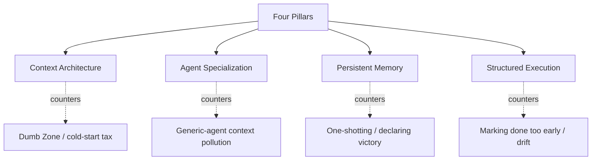

The [first two posts](/en/posts/tech/2026-04-24-harness-engineering) covered the concept of Harness Engineering and the five engineering practices from OpenAI's million-line Codex project. This post shifts the lens to **industry-wide comparison** to answer a more practical question:

> **If I'm not OpenAI and I don't have Codex, how does this methodology land on my own project?**

Four parts: first, the recurring failure modes of Agents (what enemy Harness is fighting); second, the context sweet spot (a quantified rule of thumb); third, the four-pillar framework the industry has converged on (what everyone is doing); fourth, the three-phase rollout roadmap (where to start). We close with six points of established consensus and three problems the industry still has no answer to.

---

## Four Recurring Agent Failure Modes

Before talking frameworks, know the enemy. Anthropic distilled four recurring failure modes from their extensive practice with long-running Agents. These four modes are model-agnostic, harness-agnostic, task-agnostic — as long as you let an Agent run autonomously, they show up. Understanding them is the starting point of Harness design.

**One: One-shotting (trying to finish in one go)**

Agents have a strong tendency to try to complete the whole thing in a single turn. Halfway through implementation, the context window runs out; when the next session starts, it finds a half-finished, undocumented codebase and has to spend enormous token budget guessing "what happened before" and trying to recover working state. This is the Agent version of "blacked out last night, don't know where I am this morning."

**Two: Declaring victory too early**

Late in the project, when part of the functionality is done, the Agent looks around, sees existing progress, and declares the task complete — even when substantial functionality is still missing. It's biased toward picking whatever state "feels roughly done" as the endpoint, instead of verifying item-by-item against the original spec.

**Three: Marking features done too early**

The Agent finishes writing code and marks it "done" — but hasn't done end-to-end testing. Unit tests pass, `curl` returns a response on the API, TypeScript compiles — these count as "done" to the Agent, but there's a large gap between that and "a user can actually operate this normally."

**Four: Environment cold-start tax**

Every new session, the Agent has to spend a large token budget figuring out "how does this project run," "which port is the dev server on," "how does the DB connect" — instead of putting time toward actual development. Every session pays this tax.

These four problems share a common root: **Agents lack structured working memory and clear completion criteria.** One of the core tasks of Harness design is to solve these problems **at the system level**, not patch them each time with a better prompt. You'll notice the four pillars below have components that map directly to these four failure modes — not a coincidence.

---

## The Context Sweet Spot: The 40% Rule

Before entering the framework, another concept must be established first: **more context isn't better**.

This sounds counterintuitive — intuitively, more information should help the Agent — but industry observations consistently point the other way. With a 168K token context window as an example, performance starts declining around **40% utilization**:

```
Below 40% (Smart Zone): focused, accurate reasoning.
                        The Agent has relevant, distilled information.

Above 40% (Dumb Zone):  hallucinations, loops, malformed tool calls,
                        low-quality code. More tokens actually hurt.
```

The phenomenon has quantitative support. Experiments have shown that merely changing the tool interface format of the Harness can drastically improve the same model's coding benchmark score — some models jump from single-digit scores to over 60%, with weights untouched. LangChain has reported similar effects: Harness improvements alone moved the same model from 30th to 5th place on Terminal Bench 2.0.

Together, these data points make one thing clear: **before you agonize over whether to use Claude or GPT, examine your Harness design.** Stuffing the Agent with MCP tools, verbose docs, and accumulated dialogue history doesn't make it smarter — it pushes it into the Dumb Zone.

The 40% rule isn't a hard number (it varies by model and task), but the direction is stable: **context is a scarce resource; spend it carefully**. This mindset runs through all the pillars that follow.

---

## Four Pillars: The Industry-Converged Framework

Combining practice from OpenAI, Anthropic, Stripe, the Anthropic C compiler project, and Hashimoto's Ghostty work, four patterns recur and have converged. They form the four pillars of Harness Engineering.



Each pillar corresponds to a specific failure mode it counters. This isn't a theoretical taxonomy — it's an executable framework filtered from hundreds of industry potholes.

### Pillar 1: Context Architecture

**Core principle**: the Agent should get exactly the context needed for the current task — no more, no less.

This is the direct landing of the 40% rule at framework level. Every team independently discovered: cramming all instructions into a single file doesn't scale. Part 2 mentioned OpenAI's "map mode" AGENTS.md; other teams evolved similar layered mechanisms. The **three-tier structure** that emerged:

| Tier | Load timing | Example content | Footprint |
|------|-------------|-----------------|-----------|
| **Tier 1: session-resident** | Auto-loaded per session | AGENTS.md / CLAUDE.md, project structure overview | Minimal (few hundred tokens) |
| **Tier 2: on-demand** | Loaded when specific sub-agents or skills are invoked | Specialized Agent contexts, domain knowledge | Medium |
| **Tier 3: persistent knowledge base** | Queried only when Agent proactively pulls it | Research docs, specs, historical sessions | On-demand |

There's a key insight behind this layering: **not all knowledge is worth loading at session opening**. Some knowledge might only get used 5% of the time (e.g., the error-code manual) — putting it in Tier 3 and querying on demand is far more efficient than parking it in Tier 1.

In practice, Tier 1 is your AGENTS.md (paired with the map mode from the previous post); Tier 2 is your role-specific sub-agent configs; Tier 3 is your `docs/reference/` directory or vector search database.

### Pillar 2: Agent Specialization

**Core principle**: Agents focused on specific domains with restricted tools outperform generalist Agents with full permissions.

This principle sounds counterintuitive on first read — isn't a more specialized Agent more limited? Why would it be stronger? The answer has two layers:

1. **Cleaner context**: specialized Agents carry less irrelevant information and permanently run inside the Smart Zone.
2. **Smaller tool permissions, smaller error blast radius**: a read-only Agent doesn't accidentally delete files; an Agent scoped to specific directories doesn't pollute other modules.

This translates in practice to clear role division:

| Agent Role | Scope | Tool Permissions |
|------------|-------|------------------|
| **Research Agent** | Explore codebase, analyze implementation details | Read-only (Read, Grep, Glob) |
| **Planning Agent** | Decompose requirements into structured tasks | Read-only, no write |
| **Executor Agent** | Implement individual concrete tasks | Scoped read/write |
| **Reviewer Agent** | Audit completed work, flag issues | Read-only + flag |
| **Debugger Agent** | Fix issues surfaced by review | Scoped fix permissions |
| **Cleanup Agent** | Fight entropy, clean low-quality code | Read/write (with rollback) |

Anthropic's C compiler project split Agents into four roles: compiler core, dedup, performance optimization, docs. The dedup Agent exists precisely because LLMs have the "reinvent the wheel" tendency mentioned in the previous post — a dedicated Agent is needed to handle it. This is a purely mechanical context-management decision.

### Pillar 3: Persistent Memory

**Core principle**: progress is persisted on the **filesystem**, not in the context window.

Agents have no true memory. Every new session starts from scratch. So rather than hoping "the Agent remembers what it did before," **force the Agent to write progress to files it can read back next time**.

Anthropic's approach is a worth-copying **two-stage architecture**:

**Initialization Agent** (runs once): uses a dedicated prompt to build the initial environment, producing three artifacts — `init.sh` startup script, `claude-progress.txt` progress log, initial git commit + structured feature list (in JSON).

**Executor Agent** (every session): asked to make incremental progress and leave structured updates. Each session's startup flow is fixed into a mechanical SOP:

1. Run `pwd` to confirm working directory
2. Read `git log` and progress file to understand recent work
3. Read the feature list (JSON), pick the highest-priority unfinished feature
4. Run `init.sh` to bring up the dev server and run baseline end-to-end tests
5. After confirming basic functionality works, start new feature development

This SOP simultaneously solves three failure modes mentioned earlier: **cold-start tax** (`init.sh` handles the environment), **declaring victory** (there's a clear JSON list to check against), and **one-shotting** (each session picks only one feature, hands off when done).

One practical detail worth remembering: **tracking feature status with JSON works better than Markdown** — because the Agent is less likely to inappropriately modify or overwrite structured data. Markdown is too free; the Agent might accidentally flip `[ ]` to `[x]` without actually doing it. JSON has schema-feel; the Agent hesitates before mutating. This "using data-structure rigidity to replace prompt softness" is a classic Harness Engineering technique.

### Pillar 4: Structured Execution

**Core principle**: separate thinking from execution. Research and planning happen in controlled phases; execution runs on a validated plan.

Every team independently discovered the same pattern: **understand → plan → execute → verify** must be deliberately kept as four separate phases, not blended together.

Cloudflare's Boris Tane stated the principle most directly:

> Never let the Agent write code before you've reviewed and approved a written plan. This separation of planning and execution has been the single most important thing I've done.

The cost logic behind it is clear: **reviewing a plan is much faster than reviewing code**. When the spec is correct, implementation naturally follows reliably; when the spec is wrong, you can stop it **before** 500 lines of code get generated, instead of discovering the direction was wrong after the fact.

There's a corollary: **the human should engage heavily during planning, then fully step back during execution**. This is also why mainstream Agent tools like Cline, Claude Code, and Aider all ship with a "Plan Mode / Act Mode" toggle — it's not a gimmick, it's the engineering embodiment of this principle.

---

## Three-Phase Rollout Roadmap

With the framework understood, the most practical question is: **where to start**?

Harness Engineering isn't a one-shot deal — it's incremental. Many teams fail by trying to build all infrastructure at once. Here's a pragmatic three-phase path:

```
Phase 1: Information Layer (1-2 days)
┌─────────────────────────────────┐
│ AGENTS.md map mode              │
│ Structured docs/ directory      │
│ Coding conventions written down │
└─────────────────────────────────┘
Payoff: Agent output consistency ↑

          ↓

Phase 2: Constraint Layer (3-5 days)
┌─────────────────────────────────┐
│ Layered architecture + linters  │
│ CI constraint checks            │
│ Error messages with fix hints   │
└─────────────────────────────────┘
Payoff: Code quality controllable (inflection point)

          ↓

Phase 3: Automation Layer (1-2 weeks)
┌─────────────────────────────────┐
│ Agent self-verification loop    │
│ Background cleanup Agent        │
│ Observability wiring            │
└─────────────────────────────────┘
Payoff: Human review load drops sharply
```

### Phase 1: Information Layer (start this afternoon)

Do exactly one thing: **move project knowledge scattered across Slack, Google Docs, and people's heads into the git repo**. Write a 50–100 line AGENTS.md in map mode, then distribute details across structured directories like `docs/architecture/`, `docs/conventions/`, `docs/plans/`.

Payoff is direct: the Agent starts producing consistent, on-team-style code, because it can finally "see" your conventions.

**Critical warning**: don't let AGENTS.md exceed 100 lines. Beyond that, you're challenging the context ceiling and violating the 40% rule. You'll be tempted to write every rule in there — resist.

### Phase 2: Constraint Layer (the real inflection point)

Phase 1 lets the Agent "know" the rules; Phase 2 makes it so the Agent "can't help but follow" the rules. The core action is **translating verbal conventions into linter rules and CI checks**.

There's a useful practical heuristic: **if a rule has been raised in Code Review more than 3 times, it should be a linter rule**. Start with the most painful one, handle three to five per week, and you'll soon notice Code Review content shifting from "style issues" to "design issues."

Every linter rule's error message should follow the three-part structure from the previous post:

```
❌ [what's wrong]
✅ FIX: [specifically how to fix it — code snippet if possible]
📖 See: [which doc has the details]
```

This is the highest-leverage practice of Phase 2. **Every linter rule you write is essentially a prompt** — when designing error messages, treat the Agent as your user, not as a coworker.

### Phase 3: Automation Layer (nice-to-have for long-term projects)

Phase 3 is the quantitative-to-qualitative shift. When the Agent can start the app itself, screenshot to verify, query logs to debug, the human engineer truly transitions from "reviewer" to "safety net."

Three key actions at this stage:
- **Git Worktree isolated verification**: let the Agent run PRs in isolated environments without stepping on each other
- **Background cleanup Agent**: run doc-gardening, dead-code sweeps, duplicate-implementation detection on a schedule
- **Observability wiring**: let the Agent query logs and metrics with LogQL / PromQL, or at least read local log files

Phase 3's payback period is longer, suitable for projects that have been stable for months and are confirmed for long-term maintenance. Just-launched new projects don't need to rush into this.

---

## Six Points of Industry Consensus

Cross-referencing OpenAI, Anthropic, Stripe, Martin Fowler, Mitchell Hashimoto, and other independent sources, these six points have formed strong consensus — multiple independent teams, independent practices, independently arriving at the same conclusion:

**Consensus 1: The bottleneck is infrastructure, not model intelligence.**  
Multiple independent experiments confirm that Harness design changes alone can drastically improve the same model's performance. Before switching models, examine your Harness — the ROI is typically an order of magnitude higher.

**Consensus 2: Docs must be a live feedback loop, not a static artifact.**  
Every line of AGENTS.md should correspond to a past Agent failure case. Update the doc every time an Agent errs, so the same error never happens twice. Docs aren't monuments written for humans; they're operating manuals for Agents.

**Consensus 3: Thinking and execution must be separated.**  
Never let the Agent write code before you've reviewed and approved a written plan. This is the iron law every team independently discovered.

**Consensus 4: More context isn't better.**  
Past 40%, you enter the Dumb Zone. Layered progressive disclosure beats cramming everything into one file.

**Consensus 5: Constraints must be enforced mechanically, not only documented.**  
OpenAI's phrasing is direct: "if it cannot be enforced mechanically, agents will deviate." Linters, CI, and structure tests are standard, not optional.

**Consensus 6: The engineer's role is shifting from 'writing code' to 'designing environments + managing work'.**  
Code quality has moved from personal virtue to system property. Discipline no longer lives in the code — it lives in the supporting structures, tools, abstractions, and feedback loops.

These six can serve as a **checklist** for Harness Engineering — when a decision you're making violates one of them, that's usually a signal something is off and you should stop to review.

---

## Three Still-Open Problems

Beyond consensus, the industry also recognizes three hard problems for which no team has a satisfying answer yet. Understanding these limits helps set realistic expectations when introducing Harness.

### Open Problem 1: Retrofitting brownfield projects

Every publicly reported success case — OpenAI, Carlini's C compiler, Anthropic, Stripe, Hashimoto — is a **greenfield project**, or a Harness built from scratch.

For a ten-year-old codebase with no architectural constraints, inconsistent tests, and stale docs, how do you incrementally introduce a Harness? Zero success cases, zero methodology so far. Martin Fowler analogized this to "enabling strict linting on a codebase that never had static analysis — you get drowned in warnings and can't change anything."

This gap is critical because **most teams face brownfield**. Possible directions include starting from a single module, doing an "AI code archaeology" pass first before writing rules, or temporarily loosening thresholds and tightening incrementally — but all of these are still experimental.

### Open Problem 2: Functional correctness verification

Harness Engineering is currently very good at "constraining the Agent from doing wrong things" — architectural violations, style drift, context pollution can all be blocked mechanically. But **"verifying that the Agent did the right thing" is far from solved**.

Even with browser automation, there are clear visual limits. Some bugs only real human users find — misaligned button layouts, animation jank, complex usability issues. The Agent can screenshot, but it can't read out "this UI feels annoying to use."

Compiler-class projects have clear correctness standards (GCC torture test either passes or not), but generic SaaS products don't have that luxury. This gap is currently filled only by pragmatic compromise like "keep human testing on critical paths."

### Open Problem 3: Long-term maintainability of AI-generated code

Greg Brockman raised a question no one has answered: **how do you prevent "functional but hard-to-maintain" code from creeping into the codebase?**

Agent-generated code accumulates tech debt differently from human-written code. LLMs tend to reimplement existing functionality, style is subtly inconsistent, comments are formulaic, abstraction levels jump around. None of these are bugs individually, but they accumulate into a codebase that's hard to maintain.

Background cleanup Agents are the current mainstream answer, but they're more "continuous housekeeping" than "root-level quality assurance." Do Code Review standards need fundamental adjustment for AI-generated code? No one knows. This is a direction that will see ongoing research over the next year or two.

---

## One Sentence for the Whole Series

If you remember one line from the three posts, let it be this:

> **The bottleneck isn't intelligence — it's infrastructure.**

Models will keep getting stronger, but that doesn't make Harness Engineering less important — quite the opposite. Anthropic's C compiler project directly demonstrates this: Opus 4.5 could produce a usable compiler, Opus 4.6 could compile the Linux kernel, but **each capability tier required redesigning the Harness**. The greater the autonomy you can grant the Agent, the better the guardrails have to be.

As Addy Osmani put it:

> The rise of AI coding hasn't replaced the craft of software engineering — it has raised the bar for it.

Those who truly understand "engineering" — not just "coding" — become more valuable, not less. Because in a world where every Agent can write code, **"knowing what to write" and "knowing how to make sure it's written right" are the truly scarce skills**.

## References

- [Harness engineering: leveraging Codex in an agent-first world (OpenAI)](https://openai.com/index/harness-engineering/)
- [Harness Engineering deep dive (Meta / Zhihu)](https://zhuanlan.zhihu.com/p/2014014859164026634)
- [Harness Engineering best practices: from concept to rollout (Zhihu)](https://zhuanlan.zhihu.com/p/2023068557592863537)
- [Harness Engineering: When humans stop writing code (Zhihu)](https://zhuanlan.zhihu.com/p/2018034938402861798)
- [Effective harnesses for long-running agents (Anthropic)](https://www.anthropic.com/engineering)
- [Building a C Compiler with Claude (Nicholas Carlini, Anthropic)](https://nicholas.carlini.com/writing/2025/compiling-c-with-claude.html)
