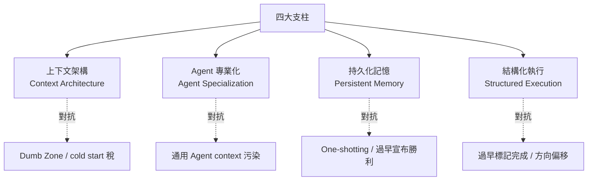

[前兩篇](/posts/tech/2026-04-24-harness-engineering)談了 Harness Engineering 的概念，以及 OpenAI 用 Codex 打造百萬行程式碼產品的五個工程實踐。這篇轉換視角，從**業界的橫向對比**出發，回答一個更實際的問題：

> **如果我不是 OpenAI、沒有 Codex，這套方法論怎麼落到我自己的專案上？**

會分四段：先看 Agent 的固定失敗模式（要對抗的敵人是什麼）、上下文的甜蜜區間（一個量化過的經驗法則）、業界收斂出的四大支柱框架（大家在做什麼）、以及三階段落地路線圖（從哪裡開始）。最後點出六大已形成的共識、以及三個目前業界都還沒解的問題。

---

## Agent 的四種固定翻車姿勢

在談框架之前，先認清敵人。Anthropic 在大量長時間運行 Agent 的實踐中，整理出了四種反覆出現的失敗模式。這四種模式不分模型、不分 harness、不分任務類型——只要你放任 Agent 自主跑，它們就會出現。理解它們是設計 Harness 的起點。

**一、試圖一步到位（One-shotting）**

Agent 有一種強烈傾向：想在一輪對話內把整件事做完。結果在實作進行到一半時 context window 就耗盡了，下一個 session 啟動時看到的是半成品、沒有文件的程式碼，只能花大量 token 猜測「之前發生了什麼」，並試圖恢復工作狀態。這是 Agent 版本的「昨晚喝斷片，早上不知道自己在哪」。

**二、過早宣布勝利**

在專案後期，當部分功能已經完成後，Agent 會環顧四周，看到已有進展就直接宣布任務完成——即使還有大量功能未實現。它會傾向於挑對它「感覺已經差不多」的狀態當終點，而不是對照原始規格逐項驗證。

**三、過早標記功能完成**

Agent 寫完程式碼就標記為「done」，但沒有做端對端測試。單元測試通過、curl 一下 API 有回應、TypeScript 編譯過——這些對 Agent 來說已經算「完成」了，但這跟「使用者能正常操作」中間差了很遠。

**四、環境啟動困難（cold start 稅）**

每次新 session 啟動時，Agent 需要花費大量 token 搞清楚「這個專案怎麼跑」、「開發伺服器在哪個 port」、「資料庫怎麼連」，而不是把時間花在實際開發上。每次 session 都在交這筆稅。

這四個問題有一個共同根源：**Agent 缺乏結構化的工作記憶和明確的完成標準**。Harness 設計的核心任務之一，就是讓這些問題**在系統層面被解決**，而不是每次靠 prompt 補救。你會發現後面的四大支柱裡，有專門對應這四種失敗模式的組件——不是巧合。

---

## 上下文的甜蜜區間：40% 法則

在進入框架前，還有一個必須先建立的觀念：**上下文不是越多越好**。

這聽起來反直覺——直覺上 Agent 資訊越充分應該做得越好——但業界的實際觀察一致指向另一個方向。以 168K token 的 context window 為例，大約用到 **40% 就開始走下坡**：

```
前 40%（Smart Zone）：聚焦、準確的推理。
                    Agent 擁有相關、精煉的資訊。

超過 40%（Dumb Zone）：幻覺、循環、格式錯誤的工具呼叫、
                     低品質程式碼。更多 token 反而損害性能。
```

這個現象有量化的旁證。有實驗發現，僅改變 Harness 的工具介面格式，就能讓同一個模型在編碼基準上的分數大幅提升——某些模型甚至從個位數跳到 60% 以上，權重完全沒動。LangChain 也報告過用 Harness 改進讓同一模型在 Terminal Bench 2.0 上從第 30 名跳到第 5 名。

這些數據合起來說明一件事：**在你糾結該用 Claude 還是 GPT 之前，先看看你的 Harness 設計。** 給 Agent 塞一堆 MCP 工具、冗長文件和累積的對話歷史，不會讓它更聰明——反而會把它推進 Dumb Zone。

這個 40% 法則不是硬性數字（不同模型、不同任務會浮動），但方向性是穩定的：**context 是稀缺資源，要精打細算地花**。這個觀念會貫穿後面所有支柱。

---

## 四大支柱：業界收斂出的框架

綜合 OpenAI、Anthropic、Stripe、Anthropic C 編譯器專案、Hashimoto 的 Ghostty 專案等多個獨立團隊的實踐，四種模式反覆出現並形成收斂。它們構成 Harness Engineering 的四大支柱。



每個支柱都對應著要對抗的具體失敗模式。這不是理論分類——這是業界踩了幾百個坑之後篩出來的可執行框架。

### 支柱一：上下文架構（Context Architecture）

**核心原則**：Agent 應當恰好獲得當前任務所需的上下文——不多不少。

這是 40% 法則在框架層的直接落地。所有團隊都獨立發現：把所有指令塞進一個文件無法擴展。上一篇提到 OpenAI 用「地圖模式」的 AGENTS.md，其他團隊也各自發展出類似的分層機制。收斂出的**三層結構**如下：

| 層級 | 加載時機 | 內容範例 | 佔用 |
|------|---------|---------|------|
| **Tier 1：session 常駐** | 每次 session 自動加載 | AGENTS.md / CLAUDE.md、專案結構概覽 | 最小（幾百 token） |
| **Tier 2：按需加載** | 特定子 Agent 或技能被調用時 | 專業化 Agent 的上下文、領域知識 | 中等 |
| **Tier 3：持久化知識庫** | Agent 主動查詢時才讀 | 研究文件、規格說明、歷史 session | 按需 |

這個分層背後有個關鍵洞察：**不是所有知識都值得 session 開場就加載**。有些東西 Agent 一輩子可能只需要用到 5%（例如錯誤碼手冊），把它放進 Tier 3、需要時查詢，比放進 Tier 1 佔用 context 划算得多。

實際落地時，Tier 1 就是你的 AGENTS.md（配合上一篇講的地圖模式）；Tier 2 是你按角色拆的子 Agent 配置檔；Tier 3 是你的 `docs/reference/` 目錄或向量檢索資料庫。

### 支柱二：Agent 專業化（Agent Specialization）

**核心原則**：專注於特定領域、擁有受限工具的 Agent，優於擁有全部權限的通用 Agent。

這條原則乍看違反直覺——更專業的 Agent 不是更受限嗎？為什麼會更強？答案有兩層：

1. **上下文更乾淨**：專業化 Agent 攜帶更少的無關資訊，永遠運行在 Smart Zone 內。
2. **工具權限更小、犯錯範圍更小**：只給讀權限的 Agent 不會意外刪檔；只能碰特定目錄的 Agent 不會污染其他模組。

這在實務上翻譯成明確的角色分工：

| Agent 角色 | 職責範圍 | 工具權限 |
|-----------|---------|---------|
| **研究 Agent** | 探索程式碼庫、分析實作細節 | 唯讀（Read, Grep, Glob） |
| **規劃 Agent** | 將需求分解為結構化任務 | 唯讀，無寫入權限 |
| **執行 Agent** | 實現單個具體任務 | 限定範圍的讀寫 |
| **審查 Agent** | 稽核完成的工作、標記問題 | 唯讀 + 標記 |
| **調試 Agent** | 修復審查發現的問題 | 限定範圍的修復 |
| **清理 Agent** | 對抗熵積累、清理低品質程式碼 | 讀寫（帶回滾） |

Anthropic 在 C 編譯器專案中把 Agent 拆成核心編譯器、去重、性能優化、文件四類角色——去重 Agent 之所以存在，就是因為 LLM 有前一篇提過的「重新發明輪子」的傾向，需要專人（專 Agent）處理。這是純機械式的 context management 決策。

### 支柱三：持久化記憶（Persistent Memory）

**核心原則**：進度持久化在**檔案系統**上，而非上下文窗口中。

Agent 沒有真正的記憶。每次新 session 從零開始。所以與其寄望「Agent 能記住之前做過什麼」，不如**強迫 Agent 把進度寫進檔案，下次自己讀回來**。

Anthropic 的做法是一個很值得抄的**兩階段架構**：

**初始化 Agent**（只跑一次）：使用專門的 prompt 建立初始環境，產出三件事——`init.sh` 啟動腳本、`claude-progress.txt` 進度日誌、初始 git commit + 結構化的功能清單（JSON 格式）。

**執行 Agent**（每次 session）：要求 Agent 做出增量進展，然後留下結構化更新。session 啟動流程被固定成一個機械 SOP：

1. 執行 `pwd` 確認工作目錄
2. 讀取 `git log` 和進度文件，了解最近的工作
3. 讀取功能清單（JSON），選擇最高優先級的未完成功能
4. 執行 `init.sh` 拉起開發伺服器、跑基礎端對端測試
5. 確認基本功能正常後，開始新功能開發

這個 SOP 同時解決了前面提過的三種失敗模式：**cold start 稅**（`init.sh` 直接搞定環境）、**過早宣布勝利**（有明確 JSON 清單對照）、**one-shotting**（每次 session 只選一個功能，做完就交棒）。

有個實務細節值得記：**用 JSON 格式追蹤功能狀態比 Markdown 更有效**——因為 Agent 不容易不恰當地修改或覆寫結構化資料。Markdown 太自由，Agent 會不小心把 `[ ]` 改成 `[x]` 又沒真的做；JSON 有 schema 感，Agent 動之前會三思。這種「用資料結構的剛性替代 prompt 的柔性」是 Harness Engineering 的一個經典手法。

### 支柱四：結構化執行（Structured Execution）

**核心原則**：將思考與執行分離。研究和規劃在受控階段進行，執行基於已驗證的計畫。

所有團隊都獨立發現同一個模式：**理解 → 規劃 → 執行 → 驗證**必須是刻意分開的四個階段，不能讓 Agent 混在一起做。

Cloudflare 的 Boris Tane 把這條原則說得最直接：

> 永遠不要讓 Agent 在你審查和批准書面計畫之前寫程式碼。這種規劃與執行的分離是我做的最重要的一件事。

背後的成本邏輯很清楚：**審查計畫遠比審查程式碼快**。當規格正確時，實作自然可靠；當規格錯了，你可以在 500 行程式碼被生成**之前**就攔下來，而不是事後才發現方向錯了要重來。

這條原則有一個推論：**規劃階段人類要重度介入，執行階段才能完全放手**。這也是為什麼 Cline、Claude Code、Aider 等主流 Agent 工具都內建了「Plan Mode / Act Mode」的切換——不是花招，是這條原則的工程化。

---

## 三階段落地路線圖

支柱框架講完了，接下來是最實際的問題：**從哪裡開始**？

Harness Engineering 不是「一把梭」，而是漸進式的。很多團隊失敗就在於想一次做完所有基礎設施。以下是一個相對務實的三階段路線：

```
Phase 1: 資訊層（1-2 天）
┌─────────────────────────┐
│ AGENTS.md 地圖模式       │
│ docs/ 結構化文件         │
│ 編碼規範明文化            │
└─────────────────────────┘
收益：Agent 輸出一致性 ↑

          ↓

Phase 2: 約束層（3-5 天）
┌─────────────────────────┐
│ 分層架構 + Linter        │
│ CI 約束檢查              │
│ 錯誤訊息含修復指令        │
└─────────────────────────┘
收益：程式碼品質可控（質變點）

          ↓

Phase 3: 自動化層（1-2 週）
┌─────────────────────────┐
│ Agent 自驗證閉環          │
│ 後台清理 Agent            │
│ 可觀測性接入              │
└─────────────────────────┘
收益：人工審查量大幅降低
```

### Phase 1：資訊層（下午就能開始）

只做一件事：**把散落在 Slack、Google Docs、腦袋裡的專案知識，搬進 git repo**。用地圖模式寫一個 50-100 行的 AGENTS.md，然後把細節分散到 `docs/architecture/`、`docs/conventions/`、`docs/plans/` 這幾個結構化目錄。

這一步的收益很直接：Agent 開始能穩定地產出符合你團隊風格的程式碼，因為它終於「看得到」你的規範了。

**關鍵警告**：AGENTS.md 不要超過 100 行。超過就是在挑戰上下文上限，違反 40% 法則。你會忍不住想把所有規則都寫進去——忍住。

### Phase 2：約束層（真正的質變點）

Phase 1 讓 Agent「知道」規則，Phase 2 讓 Agent「不得不遵守」規則。核心動作是**把口頭約定翻譯成 Linter 規則和 CI 檢查**。

實務上有個很好用的判斷法則：**如果一條規則在 Code Review 中被提過 3 次以上，就應該寫成 Linter 規則**。從最痛的那條開始，一週處理三五條，很快你會發現 Code Review 的內容從「風格問題」轉向「設計問題」。

每一條 Linter 規則的錯誤訊息都要遵守上一篇提過的三段式：

```
❌ [什麼錯了]
✅ FIX: [具體怎麼改，最好給程式碼片段]
📖 See: [哪份文件有詳細說明]
```

這是 Phase 2 最有槓桿的實踐。**你寫的每條 Linter 規則，本質上都是一個 Prompt**——設計錯誤訊息時，把 Agent 當使用者，不要當同事。

### Phase 3：自動化層（長期專案的錦上添花）

Phase 3 才是量變到質變。當 Agent 能自己啟動應用、截圖驗證、查日誌排錯，人類工程師才真正從「審查者」變成「兜底者」。

這個階段的三個關鍵動作：
- **Git Worktree 隔離驗證**：讓 Agent 在獨立環境跑 PR，互不干擾
- **後台清理 Agent**：定期執行 doc-gardening、dead code 掃描、重複實作偵測
- **可觀測性接入**：讓 Agent 能用 LogQL / PromQL 查日誌指標，或至少能讀到本地 log 檔

Phase 3 的投入回報週期比較長，適合已經穩定運轉幾個月、確定要長期維護的專案。剛啟動的新專案不用急著做這一層。

---

## 業界的六大共識

綜合 OpenAI、Anthropic、Stripe、Martin Fowler、Mitchell Hashimoto 等多個獨立來源的交叉對比，以下六點已形成強共識——多個獨立團隊、獨立實踐、獨立得出相同結論：

**共識一：瓶頸在基礎設施，不在模型智能。**  
多個獨立實驗證實，僅改變 Harness 設計就能大幅提升同一個模型的表現。在換模型之前，先審視 Harness——通常投資報酬率高一個數量級。

**共識二：文件必須是活的回饋循環，不是靜態制品。**  
AGENTS.md 每一行都應該對應一個歷史 Agent 失敗案例。每當 Agent 犯錯就更新文件，確保同樣的錯誤不會再發生第二次。文件不是寫給人看的紀念碑，是給 Agent 用的操作手冊。

**共識三：思考與執行必須分離。**  
永遠不要讓 Agent 在你審核並批准書面計畫之前寫程式碼。這是所有團隊獨立發現的鐵律。

**共識四：上下文不是越多越好。**  
超過 40% 就進入 Dumb Zone。分層漸進式披露優於把所有東西塞進一個文件。

**共識五：約束必須機械化執行，不能只靠文件記錄。**  
OpenAI 的原話很直接：「如果無法機械化強制執行，Agent 就會偏離。」Linter、CI、結構測試是標配，不是選配。

**共識六：工程師角色正在從『寫程式碼』轉向『設計環境 + 管理工作』。**  
程式碼品質從個人修養變成系統屬性。紀律不再體現在程式碼本身，而是體現在支撐結構、工具、抽象和回饋迴路中。

這六條共識可以當成 Harness Engineering 的**檢核清單**——當你做的決定違反其中一條，通常代表方向有問題，該停下來檢查。

---

## 目前仍是空白的三個問題

共識之外，業界也有三個公認的難題，目前所有團隊都還沒有令人滿意的答案。理解這三個限制，可以幫你在推 Harness 時預先設定合理的期待。

### 空白一：棕地專案的改造

所有公開的成功案例——OpenAI、Carlini 的 C 編譯器、Anthropic、Stripe、Hashimoto——**都是綠地專案**，或是從零開始建立的 Harness。

對於一個有十年歷史、沒有架構約束、測試不一致、文件殘缺的舊程式碼庫，如何漸進式引入 Harness？目前零成功案例、零方法論。Martin Fowler 把這個難題比作「在從未用過靜態分析的程式碼庫上啟用嚴格 Linter——你會被警報淹沒到什麼都改不動」。

這個空白很關鍵，因為**大多數團隊面對的都是棕地**。可能的方向包括從單一模組做起、先用 AI 做一輪「程式碼考古」再建規則、或是引入時暫時放寬閾值再逐步收緊——但這些都還在探索階段。

### 空白二：功能正確性驗證

Harness Engineering 目前很擅長「約束 Agent 不做錯事」——架構違規、風格漂移、上下文污染，這些都能被機械化擋下來。但**「驗證 Agent 做對了事」這個問題遠未解決**。

即使有瀏覽器自動化，也有明顯的視覺侷限。有些 bug 只有真正的人類使用者能發現——例如按鈕排版錯位、動畫卡頓感、複雜的可用性問題。Agent 可以截圖，但它讀不出「這個介面用起來很煩」這種感受。

編譯器類專案有明確的正確性標準（GCC torture test 過或不過），但一般 SaaS 產品沒有這種奢侈品。這個空白目前只能靠「保留關鍵路徑的人工測試」這種務實妥協來填。

### 空白三：AI 生成程式碼的長期可維護性

Greg Brockman 拋出過一個至今無人回答的問題：**怎麼防止「功能沒問題但可維護性很差」的程式碼滲透進 codebase？**

Agent 寫的程式碼和人類寫的積累技術債的方式不一樣。LLM 傾向於重新實作已有功能、風格微妙地不一致、註解偏形式化、抽象層次跳動。這些單獨看都不算 bug，但累積起來會讓程式碼庫難以維護。

後台清理 Agent 是目前的主流答案，但它更像是「持續打掃」，不是「根本性的品質保證」。Code Review 的標準是否需要針對 AI 生成程式碼做根本性調整？沒人知道。這是一個未來一兩年會持續有新研究的方向。

---

## 一句話總結整個系列

如果三篇文章看完只記一句話，那應該是：

> **瓶頸不在智能，而在基礎設施。**

模型會繼續變強，但這不會讓 Harness Engineering 變得不重要——恰恰相反。Anthropic 的 C 編譯器專案直接印證了這一點：Opus 4.5 能產出能用的編譯器，Opus 4.6 能編譯 Linux 核心，但**每個能力等級都需要重新設計 Harness**。能給 Agent 的自主空間越大，護欄就得越好。

正如 Addy Osmani 說的：

> AI 編碼的興起並沒有取代軟體工程的工藝——它抬高了工藝的門檻。

那些真正理解「工程」而非只擅長「編碼」的人，價值不是下降了，而是上升了。因為在一個 Agent 都會寫程式碼的世界裡，**「知道該寫什麼」和「知道怎麼確保寫對」，才是真正稀缺的能力**。

## 參考資料

- [Harness engineering: leveraging Codex in an agent-first world（OpenAI）](https://openai.com/index/harness-engineering/)
- [Harness Engineering 深度解析（Meta / 知乎）](https://zhuanlan.zhihu.com/p/2014014859164026634)
- [Harness Engineering 最佳實踐：從概念到落地的完整操作手冊（知乎）](https://zhuanlan.zhihu.com/p/2023068557592863537)
- [Harness Engineering：當人類不再寫程式碼（知乎）](https://zhuanlan.zhihu.com/p/2018034938402861798)
- [Effective harnesses for long-running agents（Anthropic）](https://www.anthropic.com/engineering)
- [Building a C Compiler with Claude（Nicholas Carlini, Anthropic）](https://nicholas.carlini.com/writing/2025/compiling-c-with-claude.html)
