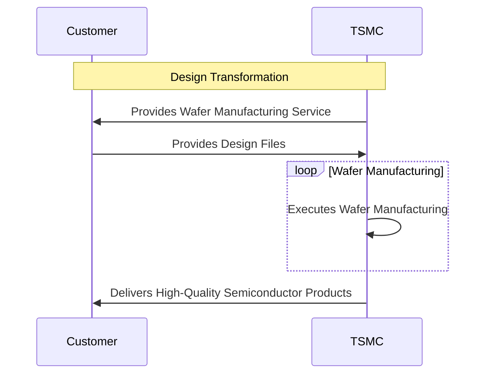

Here is the translated article:

Soaring! 📈 Will TSMC Lead the Taiwanese Stock Market to Break 40,000 and Rush to 50,000 Points? Taiwan's Tech Empire Dominates the AI World!

## TL;DR
TSMC's semiconductor foundry technology is the key to Taiwan's tech empire dominating the AI world.

## What is it
TSMC's semiconductor foundry technology is a service that transforms customers' designs into physical wafers, providing customers with high-quality semiconductor products.

## Why is it important
TSMC's semiconductor foundry technology solves customers' needs for manufacturing high-quality semiconductor products, while also driving the development of the global semiconductor industry.

## How it works
The workflow of TSMC's semiconductor foundry technology is as follows:

## Difference from UMC, Samsung, and Intel
The difference between TSMC's semiconductor foundry technology and that of UMC, Samsung, and Intel lies in its manufacturing technology and customer service. TSMC's manufacturing technology is more advanced, and its customer service is more comprehensive.

## In conclusion
TSMC's semiconductor foundry technology is suitable for customers who need to manufacture high-quality semiconductor products, especially those who require advanced manufacturing technology and comprehensive customer service.

## References
NA