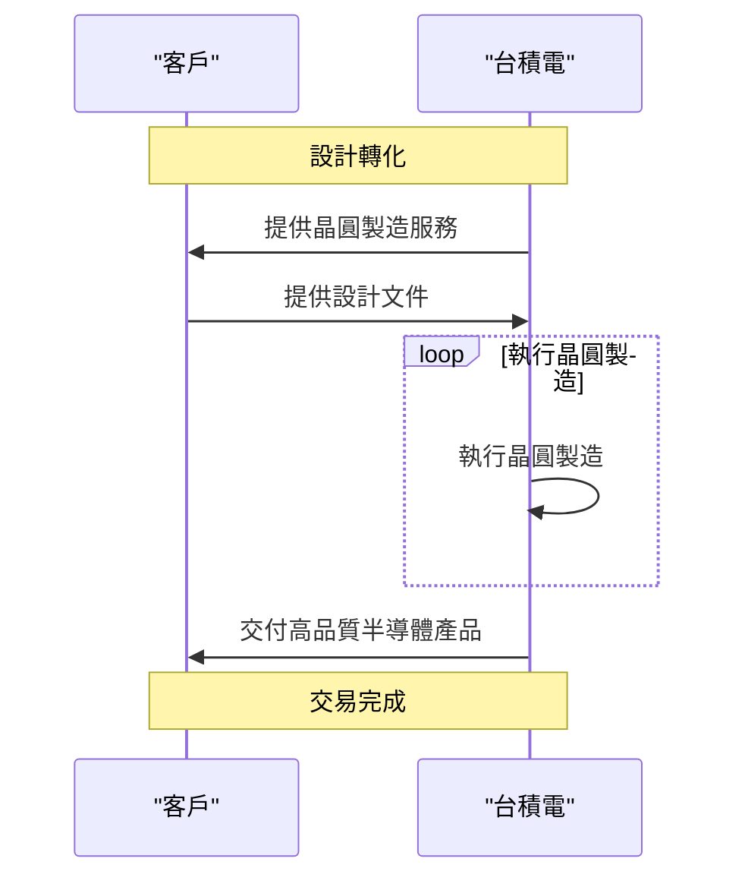

狂漲！📈台積電領軍台股破四萬再衝五萬點？【台灣科技帝國稱雄AI世界！】 TSMC晶圓代工制霸的關鍵戰役！護國神山如何擊敗聯電三星電子英特爾？張忠謀魏哲家改變全球產業版圖的半導體爭霸96國際政經298

## TL;DR
台積電的半導體晶圓代工技術是台灣科技帝國稱雄AI世界的關鍵。

## 是什麼
台積電的半導體晶圓代工技術是一種將客戶的設計轉化為實體晶圓的服務，提供客戶製造高品質的半導體產品。

## 為什麼重要
台積電的半導體晶圓代工技術解決了客戶製造高品質半導體產品的需求，同時也推動了全球半導體產業的發展。

## 怎麼運作
台積電的半導體晶圓代工技術運作流程如下：

## 跟聯電三星電子英特爾的差別
台積電的半導體晶圓代工技術與聯電三星電子英特爾的差別在於其製造技術和客戶服務。台積電的製造技術更為先進，客戶服務也更為周到。

## 小結
台積電的半導體晶圓代工技術適合需要製造高品質半導體產品的客戶，特別是那些需要先進製造技術和周到客戶服務的客戶。

## 參考資料

- [狂漲！📈台積電領軍台股破四萬再衝五萬點？【台灣科技帝國稱雄AI世界！】 TSMC晶圓代工制霸的關鍵戰役！護國神山如何擊敗聯電三星電子英特爾？張忠謀魏哲家改變全球產業版圖的半導體爭霸96國際政經298](https://www.youtube.com/watch?v=gIX5E1G_dLE)