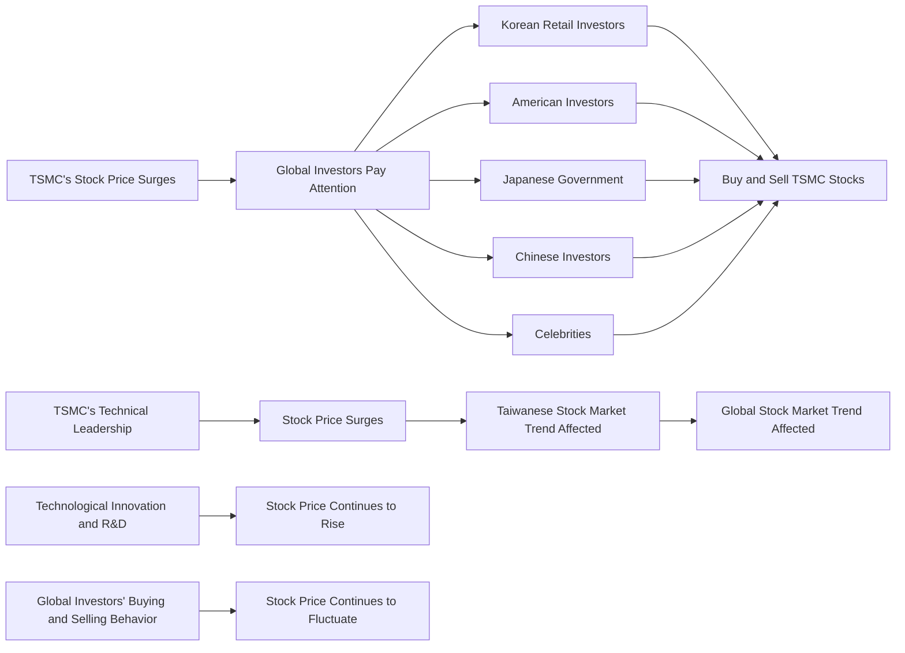

## TL;DR
TSMC's stock price has reached a new high, attracting attention and frantic buying and selling from global investors. This event has significant implications for Taiwan's economy and financial markets.

## What Happened
TSMC's stock price has surged in recent times, attracting attention and frantic buying and selling from global investors. Reports indicate that Korean retail investors, American investors, and the Japanese government are all scrambling to buy TSMC stocks. Meanwhile, Chinese investors are also actively participating in buying and selling TSMC stocks, with even celebrities joining in.

## Why This Matters
As the world's leading semiconductor foundry, TSMC's stock price fluctuations have a significant impact on Taiwan's economy and financial markets. The surge in TSMC's stock price represents the prosperity of Taiwan's semiconductor industry and global market confidence. Additionally, TSMC's stock price affects the overall trend of the Taiwanese stock market and even influences global stock market trends.

## Technical Perspective
From a technical standpoint, the surge in TSMC's stock price may be attributed to its leading position and technical advantages in the semiconductor industry. TSMC's technology and production capabilities in the foundry sector are world-leading, and the company continues to drive technological innovation and develop new products. These factors contribute to the increase in TSMC's stock price.

## What to Watch Out for Next
Going forward, it is worth observing whether TSMC's stock price can continue to rise and whether global investors' buying and selling behavior will remain frantic. Additionally, it is essential to monitor whether TSMC's technological innovation and industry development can continue to drive its stock price up.

## References
Video Title: TSMC's Stock Price Skyrockets, and the World Goes Crazy for Taiwan! [KR] Korean Retail Investors, [US] American Investors, and [JP] Japanese Government Scramble to Buy! Believe Wei Zhejia, and Buy a New Home Tomorrow! Hushang God's Market Value Breaks 2 Trillion USD, and the Weighted Index Rushes to 50,000 Points? The World Focuses on Taiwanese Stocks, Chinese Investors Vote with Their Money, and Celebrities Love Buying TSMC Stocks!

## Technical Structure Diagram

