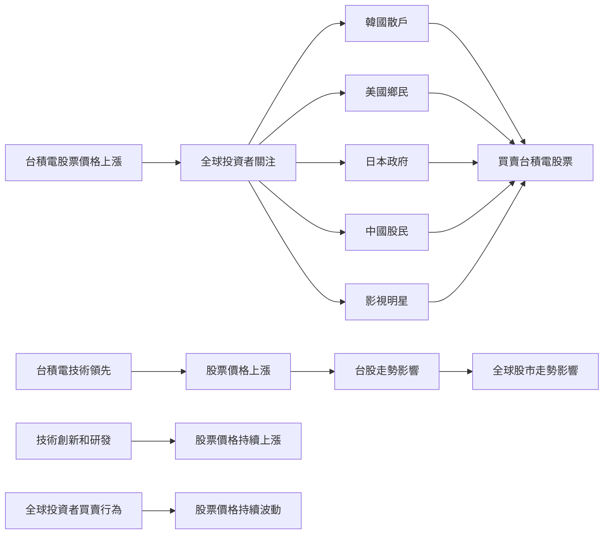

## TL;DR
台積電的股票價格創下新高，引發全球投資者的關注和瘋狂買賣。這件事情對台灣的經濟和金融市場有著重要的意義。

## 發生了什麼
台積電的股票價格在近期內大幅上漲，引發全球投資者的關注和瘋狂買賣。據報導，韓國散戶、美國鄉民和日本政府都在搶購台積電的股票。同時，中國股民也積極參與買賣台積電股票，甚至有影視明星也加入了買賣台積電股票的行列。

## 為什麼這件事值得關注
台積電作為全球領先的晶圓代工廠，其股票價格的波動對於台灣的經濟和金融市場有著重要的影響。台積電的股票價格上漲，代表著台灣半導體產業的繁榮和全球市場的信心。同時，台積電的股票價格也影響著台股的整體走勢，甚至影響著全球股市的走勢。

## 技術角度怎麼看
從技術角度來看，台積電的股票價格上漲，可能與其在半導體產業中的領先地位和技術優勢有關。台積電在晶圓代工領域的技術和生產能力是全球領先的，同時其也在不斷推動技術創新和研發新產品。這些因素都有助於台積電的股票價格上漲。

## 後續值得觀察的點
接下來值得觀察的是台積電的股票價格是否能夠持續上漲，和全球投資者的買賣行為是否會持續瘋狂。同時，也需要關注台積電的技術創新和產業發展是否能夠持續推動其股票價格上漲。

## 參考資料
影片標題：台積電漲到全球瘋台灣！【🇰🇷韓國散戶🇺🇸美國鄉民🇯🇵日本政府搶搶搶！】相信魏哲家，明天買新家！護國神山市值破兩兆美元，加權指數衝五萬點？世界聚焦台股，中國股民用錢投票，影視明星愛買TSMC成流行？

## 技術結構圖

- [台積電漲到全球瘋台灣！【🇰🇷韓國散戶🇺🇸美國鄉民🇯🇵日本政府搶搶搶！】相信魏哲家，明天買新家！護國神山市值破兩兆美元，加權指數衝五萬點？世界聚焦台股，中國股民用錢投票，影視明星愛買TSMC成流行？](https://www.youtube.com/watch?v=Eym6Sp9yEHo)