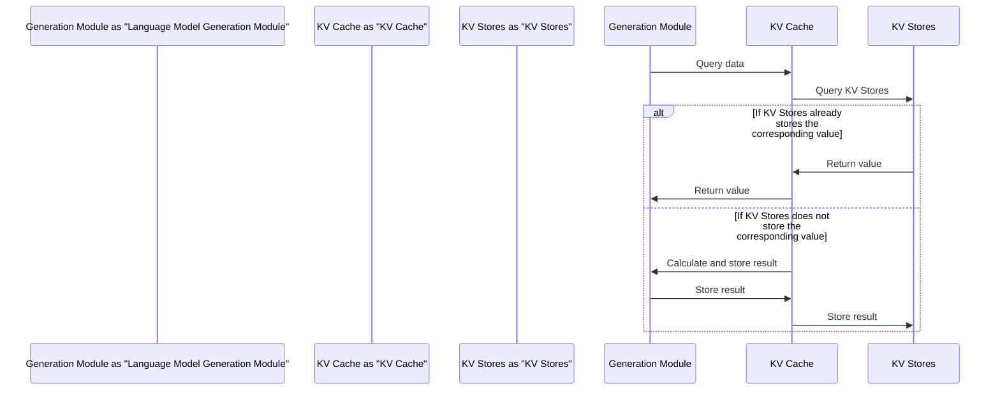

Speeding Up Language Model Generation: KV Cache
=====================================

This article delves into the application of KV Cache in language model generation, exploring its design philosophy, core concepts, and comparisons with common alternative solutions, as well as suitable scenarios. Through this article, readers will understand how KV Cache accelerates language model generation and apply this technology in practical projects.

## TL;DR

KV Cache is a caching technology that effectively speeds up language model generation.

## Design Philosophy

The design of KV Cache aims to solve the problem of repeated data access during language model generation. Traditional language model generation processes require multiple accesses to model parameters, vocabulary tables, and other large amounts of data, resulting in slower generation speeds. KV Cache caches frequently accessed data, reducing the number of data accesses during model generation and thereby increasing generation speed.

## Core Concepts

The core concept of KV Cache is to use Key-Value Stores (KV Stores) to store data in language models. KV Stores are a type of NoSQL database that efficiently stores and queries large amounts of key-value data. In KV Cache, the key is a word or parameter in the language model, and the value is the corresponding value. When the language model needs to access data, KV Cache first queries the KV Stores to see if the corresponding value is already stored. If it is, the value is returned directly; otherwise, the result is calculated and stored.

## Comparison with Common Alternative Solutions

| Solution | Advantages | Disadvantages |
| --- | --- | --- |
| KV Cache | Effectively speeds up language model generation | Requires additional KV Stores resources |
| Traditional caching technology | Simple and easy to use | Low cache hit rate, limited effect |

## Suitable/Unsuitable Scenarios

KV Cache is suitable for:

* Language model generation projects that require large amounts of data access
* Situations with sufficient KV Stores resources

KV Cache is not suitable for:

* Language model generation projects with minimal data access
* Situations with limited KV Stores resources

## In Conclusion

KV Cache is a technology that effectively speeds up language model generation, particularly suitable for projects that require large amounts of data access. Although it requires additional KV Stores resources, its advantages far outweigh its disadvantages. Therefore, KV Cache is a technology worth considering, especially in large-scale language model generation projects.

## References

* [KV Stores](https://en.wikipedia.org/wiki/Key%E2%80%93value_database)
* [Language Model Generation](https://zh.wikipedia.org/wiki/%E8%AF%AD%E8%A8%80%E6%A8%A1%E5%9E%8B)