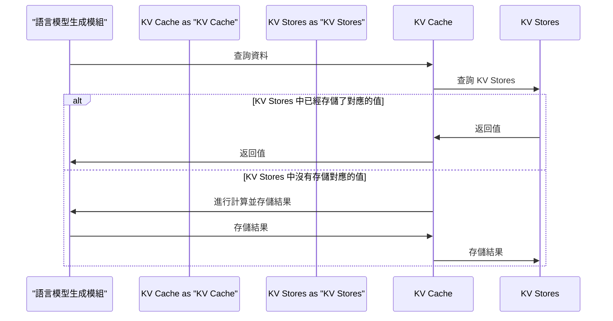

加快語言模型生成速度 (2/2)：KV Cache
=====================================

本文將深入介紹 KV Cache 在語言模型生成中的應用，探討其設計哲學、核心概念、與常見替代方案的比較，以及適合的情境。透過本文，讀者將能夠了解 KV Cache 如何提升語言模型生成速度，並在實際專案中應用此技術。

## TL;DR

KV Cache 是一種緩存技術，可有效加快語言模型生成速度。

## 設計哲學

KV Cache 的設計初衷在於解決語言模型生成過程中，反覆存取大量資料的問題。傳統的語言模型生成過程，需要多次存取模型參數、詞彙表等大量資料，導致生成速度變慢。KV Cache 通过缓存这些频繁访问的数据，减少了模型生成过程中的数据访问次数，从而提升生成速度。

## 核心概念

KV Cache 的核心概念是使用 Key-Value Stores（KV Stores）來存儲語言模型中的資料。KV Stores 是一種 NoSQL 資料庫，能夠高效地存儲和查詢大量的 key-value 數據。在 KV Cache 中，Key 是語言模型中的詞彙或參數，Value 是對應的值。當語言模型需要存取資料時，KV Cache 首先查詢 KV Stores 中是否已經存儲了對應的值，如果有則直接返回，否則才進行計算並存儲結果。

## 跟常見替代方案比較

| 方案 | 優點 | 缺點 |
| --- | --- | --- |
|KV Cache | 有效提升語言模型生成速度 | 需要額外的 KV Stores 資源 |
|傳統緩存技術 | 簡單易用 | 緩存命中率低，效果有限 |

## 適合 / 不適合的情境

KV Cache 適合於：

*   需要大量資料存取的語言模型生成專案
*   有足夠的 KV Stores 資源的情況下

KV Cache 不適合於：

*   資料存取量少的語言模型生成專案
*   KV Stores 資源有限的情況下

## 整體來說

KV Cache 是一種有效提升語言模型生成速度的技術，特別適合於需要大量資料存取的語言模型生成專案。雖然需要額外的 KV Stores 資源，但其優勢遠大於缺點。因此，KV Cache 是一種值得考慮的技術，特別是在大規模語言模型生成專案中。

## 參考資料

*   [KV Stores](https://en.wikipedia.org/wiki/Key%E2%80%93value_database)
*   [語言模型生成](https://zh.wikipedia.org/wiki/%E8%AF%AD%E8%A8%80%E6%A8%A1%E5%9E%8B)
- [加快語言模型生成速度 (2/2)：KV Cache](https://www.youtube.com/watch?v=fDQaadKysSA)