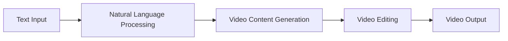

Designing Sora / Text-to-Video System
=====================================

Introduction
------------

This article introduces Design Sora's Text-to-Video system, a technology that converts text into video. After reading this article, readers will understand the working principle and application scenarios of this system.

TL;DR: Design Sora's Text-to-Video system is a technology that converts text into video.

What is it?
------------

Design Sora's Text-to-Video system is an AI-based video generation technology that converts text into video. This system uses natural language processing (NLP) and computer vision techniques to transform text descriptions into video content.

Why is it important?
--------------------

Design Sora's Text-to-Video system solves the efficiency and creativity problems of video content generation. Traditional video generation methods require a large amount of manual editing and creation time, while this system can automatically generate video content, saving time and cost.

How does it work?
-----------------

The working principle of Design Sora's Text-to-Video system is as follows:

First, the user inputs text descriptions, and then the natural language processing module converts the text descriptions into video content. Next, the video content generation module edits the video content into the final video. Finally, the video output module outputs the generated video to the user.

Differences from traditional video generation methods
---------------------------------------------------

The main difference between Design Sora's Text-to-Video system and traditional video generation methods is the degree of automation. Traditional methods require a large amount of manual editing and creation time, while Design Sora's system can automatically generate video content, saving time and cost.

Conclusion
----------

Design Sora's Text-to-Video system is suitable for enterprises and individuals who need to generate a large amount of video content, such as advertising companies, media companies, and personal creators. This system can save time and cost, improving the efficiency of video content generation.

References
----------

* Design Sora official website: https://www.designsora.com/