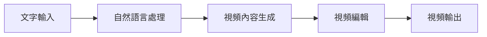

開頭：本文將介紹 Design Sora 的 Text-to-Video 系統，這是一個能夠將文字轉換為視頻的技術。讀者看完本文將能夠理解這個系統的工作原理和應用場景。

TL;DR：Design Sora 的 Text-to-Video 系統是一個能夠將文字轉換為視頻的技術。

## 是什麼
Design Sora 的 Text-to-Video 系統是一個基於人工智慧的視頻生成技術，能夠將文字轉換為視頻。這個系統使用自然語言處理（NLP）和計算機視覺技術將文字描述轉換為視頻內容。

## 為什麼重要
Design Sora 的 Text-to-Video 系統能夠解決視頻內容生成的效率和創意問題。傳統的視頻生成方法需要大量的人工編輯和創作時間，而這個系統能夠自動生成視頻內容，節省時間和成本。

## 怎麼運作
Design Sora 的 Text-to-Video 系統的工作原理如下：

首先，使用者輸入文字描述，然後自然語言處理模組將文字描述轉換為視頻內容。接著，視頻內容生成模組將視頻內容編輯成最終的視頻。最後，視頻輸出模組將生成的視頻輸出給使用者。

## 跟傳統視頻生成方法的差別
Design Sora 的 Text-to-Video 系統與傳統視頻生成方法的主要差別在於自動化程度。傳統方法需要大量的人工編輯和創作時間，而 Design Sora 的系統能夠自動生成視頻內容，節省時間和成本。

## 小結
Design Sora 的 Text-to-Video 系統適合需要大量視頻內容生成的企業和個人使用，例如廣告公司、媒體公司和個人創作者。這個系統能夠節省時間和成本，提高視頻內容生成的效率。

## 參考資料
* Design Sora 官網：https://www.designsora.com/
- [Design Sora / Text-to-Video system](https://www.youtube.com/watch?v=ZuQ4B0CwNjo)