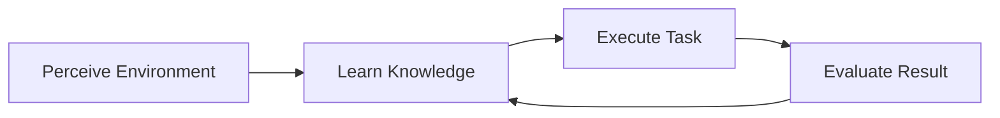
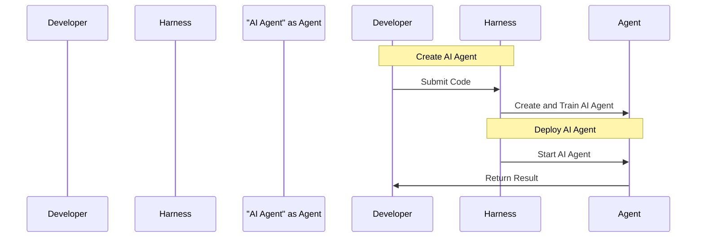

# What is the Working Principle of AI Agents and What is Harness?

## TL;DR
Understand the basic concepts of AI Agent working principles and the Harness framework.

## What is it
An AI Agent is an artificial intelligence program that can execute tasks in a specific environment and achieve optimal results through learning and improvement. Harness is a framework that helps developers build and manage AI Agents.

## Why is it important
AI Agents can automate many repetitive tasks, increasing work efficiency and accuracy. Harness simplifies the development and management process of AI Agents, making it easier for developers to build and deploy AI applications.

## How it works
The working principle of AI Agents involves perceiving the environment, learning knowledge, and executing tasks. The specific process is as follows:

The Harness framework provides a set of tools and services that enable developers to build, train, and deploy AI Agents. The specific process is as follows:

## Differences from other machine learning frameworks
The main difference between the Harness framework and other machine learning frameworks is that it provides complete AI Agent development and management capabilities, making it easier for developers to build and deploy AI applications.

## Summary
The Harness framework is suitable for developers who want to build and deploy AI applications, especially those who need to automate repetitive tasks and increase work efficiency.

## References
https://www.harness.io/