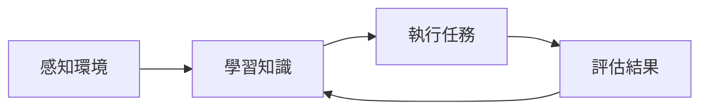
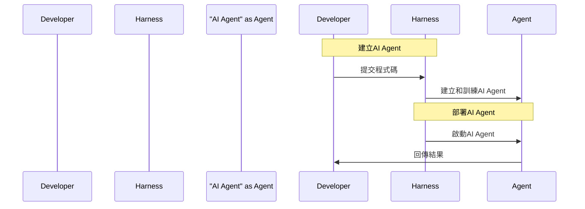

# AI Agent工作原理是什么，Harness又是什么？

## TL;DR
了解 AI Agent 工作原理和 Harness 框架的基本概念。

## 是什麼
AI Agent是一種人工智慧程式，能夠在特定環境中執行任務，並通過學習和改進來達到最佳結果。Harness是一種框架，能夠幫助開發人員建立和管理AI Agent。

## 為什麼重要
AI Agent能夠自動化許多重複性任務，提高工作效率和精確度。Harness能夠簡化AI Agent的開發和管理過程，讓開發人員更容易建立和部署AI應用。

## 怎麼運作
AI Agent的工作原理是通過感知環境、學習知識和執行任務。具體流程如下：

Harness框架則提供了一套工具和服務，讓開發人員能夠建立、訓練和部署AI Agent。具體流程如下：

## 跟其他機器學習框架的差別
Harness框架與其他機器學習框架的主要差別在於其能夠提供完整的AI Agent開發和管理功能，讓開發人員能夠更容易建立和部署AI應用。

## 小結
Harness框架適合那些想要建立和部署AI應用的開發人員，特別是那些需要自動化重複性任務和提高工作效率的企業。

## 參考資料
https://www.harness.io/
- [AI Agent工作原理是什么，Harness又是什么，一个动画彻底搞懂！](https://www.youtube.com/watch?v=B91bZL8wcAI)