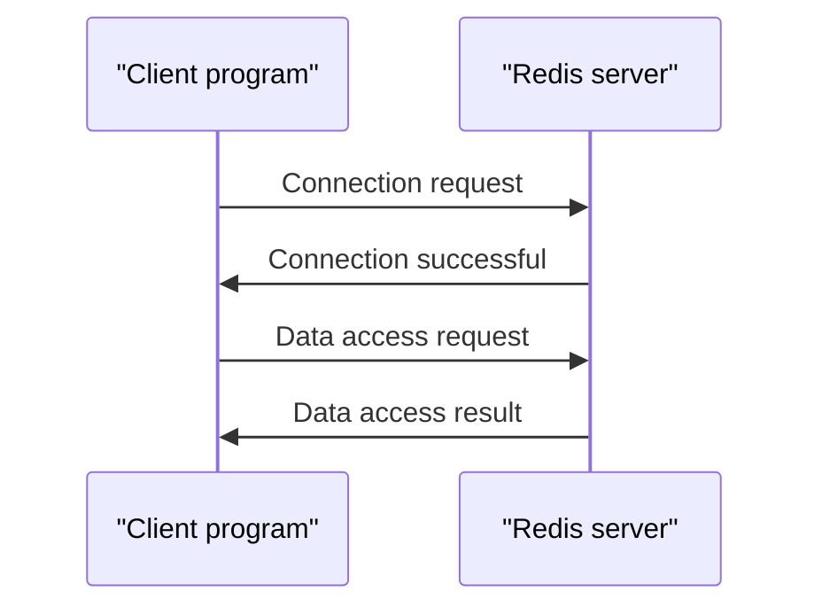

What is Redis? Why is it so popular?

## TL;DR
Redis is an in-memory data storage system that combines the benefits of a database and a cache.

## What is it
Redis (Remote Dictionary Server) is an in-memory data storage system that can store and manage various data structures, such as strings, hash tables, lists, and sets. It supports multiple programming languages, including Python, Java, and C++.

## Why is it important
Redis solves the performance bottleneck of traditional databases, providing efficient data access and management. It can serve as a cache layer for databases, reducing database load and latency. Additionally, Redis can be used as a standalone data storage system, providing fast data access and querying.

## How it works

## Differences with Memcached
Redis and Memcached are both in-memory caching systems, but Redis provides more data structures and features, including persistence and data partitioning. Memcached is mainly used for simple caching applications, while Redis is suitable for more complex data storage and management scenarios.

## Summary
Redis is suitable for applications that require efficient data access and management, such as social media, instant messaging, and gaming. It can also serve as a cache layer for databases, reducing database load and latency.

## References
* Redis official website: <https://redis.io/>