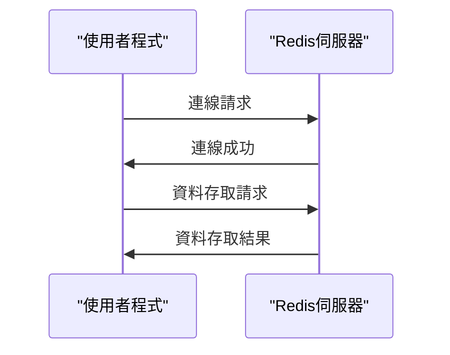

Redis 真的是什麼？為什麼它如此受歡迎？

## TL;DR
Redis是一種基於記憶體的資料儲存系統，結合了資料庫和快取的優勢。

## 是什麼
Redis（Remote Dictionary Server）是一種基於記憶體的資料儲存系統，可以儲存和管理各種資料結構，如字串、哈希表、列表、集合等。它支援多種程式語言，包括Python、Java、C++等。

## 為什麼重要
Redis解決了傳統資料庫的效能瓶頸，提供了高效的資料存取和管理。它可以作為資料庫的快取層，減少資料庫的負載和延遲。另外，Redis也可以作為獨立的資料儲存系統，提供快速的資料存取和查詢。

## 怎麼運作

## 跟 Memcached 的差別
Redis和Memcached都是基於記憶體的快取系統，但Redis提供了更多的資料結構和功能，包括持久化儲存、資料分區等。Memcached主要用於簡單的快取應用，Redis則適用於更複雜的資料儲存和管理場景。

## 小結
Redis適合用於需要高效資料存取和管理的應用，例如社交媒體、即時通訊、遊戲等。它也可以作為資料庫的快取層，減少資料庫的負載和延遲。

## 參考資料
* Redis官方網站：<https://redis.io/>
- [What Is Redis Really About? Why Is It So Popular?](https://www.youtube.com/watch?v=z_NbVtbgBJw)