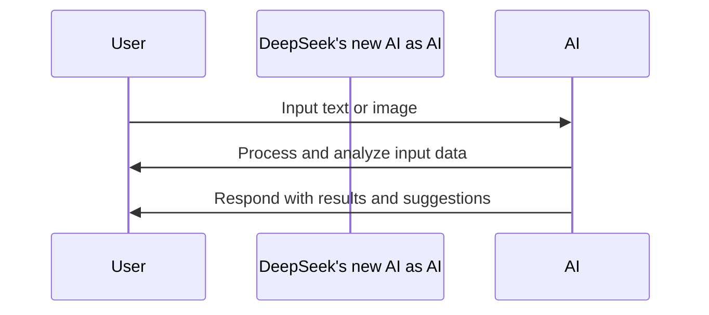

# The Birth of DeepSeek's New AI: Game-Changing Technology

## TL;DR
DeepSeek's new AI is a revolutionary technology that will change the way people interact with AI.

## What is it
DeepSeek's new AI is an advanced artificial intelligence technology that combines the latest achievements in natural language processing, computer vision, and deep learning. This technology allows users to interact with machines in a more natural and intuitive way, leading to more efficient and intelligent work and life.

## Why is it important
DeepSeek's new AI overcomes the limitations of traditional AI technologies, such as insufficient language understanding and rigid interaction methods. The emergence of this technology will lead to a wider range of applications, including intelligent customer service, intelligent assistants, and intelligent healthcare.

## How it works
The operating principle of DeepSeek's new AI is as follows:

## Differences from traditional AI
The main differences between DeepSeek's new AI and traditional AI lie in its stronger understanding of natural language and images, as well as its more natural and intuitive interaction methods. This enables DeepSeek's new AI to be applied in more fields and scenarios.

## Summary
DeepSeek's new AI is a revolutionary technology suitable for companies and users across various industries. It can improve work efficiency, enhance user experience, and create new business value.

## References
[DeepSeek Official Website](https://www.deepseek.ai/)