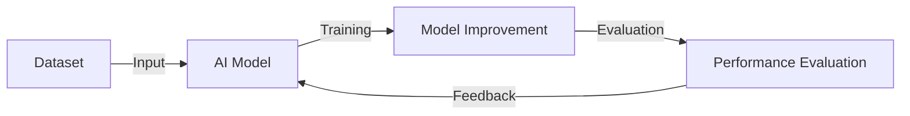

# Is AI Ready to Cross the Rubicon? How Far Are We from Self-Improving AI?

## TL;DR
AI's self-improvement capabilities are on the verge of crossing the Rubicon, marking a new milestone.

## What is it?
Self-improving AI is a type of artificial intelligence system that can enhance its own capabilities through learning and adaptation to new data. It can improve its predictive and decision-making abilities, and even discover new patterns and knowledge on its own.

## Why is it important?
Self-improving AI will revolutionize the way we interact with AI. It can learn and adapt to new applications with minimal human intervention, increasing the flexibility and efficiency of AI systems. Moreover, self-improving AI can help us better understand complex systems and phenomena, leading to new scientific breakthroughs and business opportunities.

## How does it work?
The operating principle of self-improving AI can be described by the following flowchart:

In this process, the AI model improves its capabilities through training on the dataset, and then iterates and optimizes through evaluation and feedback.

## Differences from traditional AI
The key difference between self-improving AI and traditional AI lies in its ability to self-improve. Traditional AI systems typically require human intervention and updates to improve their performance, whereas self-improving AI can learn and adapt to new data and scenarios on its own.

## Conclusion
Self-improving AI will be a crucial trend in the future development of AI. It can help us better understand and apply AI technology, leading to new business opportunities and scientific breakthroughs. However, self-improving AI also requires us to pay closer attention to its safety and ethics to ensure its healthy development and application.

## References
* [Video Title: Is AI Ready to Cross the Rubicon? How Far Are We from Self-Improving AI? (Part 2)](https://www.youtube.com/watch?v=dQw4w9WgXcQ)