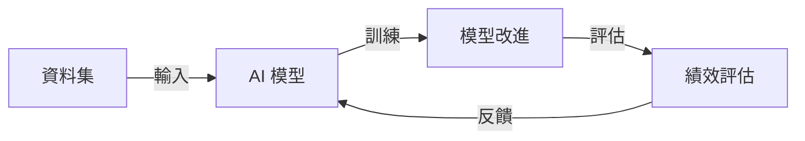

# AI 要跨越盧比孔河了嗎？自我成長的 AI 離我們多遠

## TL;DR
AI 自我成長的能力即將跨越盧比孔河，迎接嶄新的里程碑。

## 是什麼
自我成長的 AI 是一種能夠自行改進和增強其自身能力的人工智慧系統。它們可以通過學習和適應新資料，提高其預測和決策能力，甚至可以自行發現新的模式和知識。

## 為什麼重要
自我成長的 AI 將革命性地改變我們與 AI 的互動方式。它們可以自行學習和適應新的應用場景，減少人工介入的需要，提高 AI 系統的靈活性和效率。同時，自我成長的 AI 還可以幫助我們更好地理解複雜系統和現象，帶來新的科學突破和商業機會。

## 怎麼運作
自我成長的 AI 的運作原理可以用以下流程圖來描述：

在這個流程中，AI 模型通過訓練資料集來改進其自身能力，然後經過評估和反饋，不斷迭代和優化。

## 跟傳統 AI 的差別
自我成長的 AI 與傳統 AI 的最大差別在於其自我改進的能力。傳統 AI 系統通常需要人工介入和更新才能提高其性能，而自我成長的 AI 可以自行學習和適應新的資料和場景。

## 小結
自我成長的 AI 將是未來 AI 發展的重要趨勢。它可以幫助我們更好地理解和應用 AI 技術，帶來新的商業機會和科學突破。同時，自我成長的 AI 也需要我們更加關注其安全性和倫理性，以確保其健康發展和應用。

## 參考資料
* [影片標題：AI 要跨越盧比孔河了嗎？自我成長的 AI 離我們多遠 (下集)](https://www.youtube.com/watch?v=dQw4w9WgXcQ)
- [AI 要跨越盧比孔河了嗎？自我成長的 AI 離我們多遠 (下集)](https://www.youtube.com/watch?v=cQLKVzbwN7I)