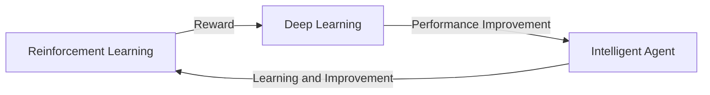

Here is the translated article:

DeepMind's Crazy AI Breakthrough: A Conversation with CEO Demis Hassabis
===========================================================

Introduction
------------

This article delves into DeepMind's remarkable AI breakthrough and shares insights from CEO Demis Hassabis. After reading this article, you will understand DeepMind's AI research achievements and the technical principles behind them.

TL;DR
--------

DeepMind's AI breakthrough: Combining reinforcement learning and deep learning to create intelligent agents that surpass human capabilities.

What is DeepMind?
-----------------

DeepMind is an artificial intelligence research company founded in 2010 by Demis Hassabis, Shane Legg, and Mustafa Suleyman. DeepMind's primary research focus is on reinforcement learning and deep learning, aiming to create intelligent agents that surpass human capabilities.

Why is it important?
-------------------

DeepMind's AI breakthrough lies in combining reinforcement learning and deep learning, creating a new type of intelligent agent. This agent can learn and improve its performance, reaching levels beyond human capabilities. This technological breakthrough will have a significant impact on the field of artificial intelligence, opening up new application prospects.

How does it work?
-----------------

DeepMind's AI breakthrough is based on the combination of reinforcement learning and deep learning. Reinforcement learning is a machine learning method that learns through trial and error and rewards. Deep learning is a neural network-based learning method that can learn and represent complex data patterns. By combining these two methods, DeepMind's AI system can learn and improve its performance, reaching levels beyond human capabilities.

Differences from other AI research
---------------------------------

The main difference between DeepMind's AI breakthrough and other AI research lies in its combination of reinforcement learning and deep learning. Other AI research may focus on only one of these methods or use traditional machine learning methods. DeepMind's approach combines both methods, creating a new type of intelligent agent.

Conclusion
----------

DeepMind's AI breakthrough is a significant achievement that will have a major impact on the field of artificial intelligence. By combining reinforcement learning and deep learning, DeepMind's AI system can learn and improve its performance, reaching levels beyond human capabilities. This technological breakthrough will open up new application prospects, making it worth attention and research.

References
----------

* DeepMind's official website: https://www.deepmind.com/
* Demis Hassabis' lecture: https://www.youtube.com/watch?v=TQEE1Ou6HkY