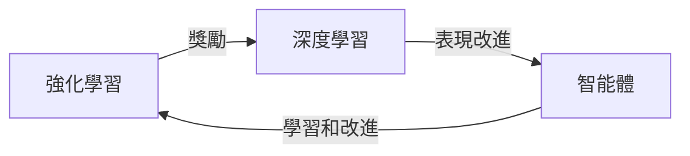

開頭
--------

這篇文章將深入探討 DeepMind 的驚人 AI 突破，以及 CEO Demis Hassabis 的分享。讀完這篇文章，你將了解 DeepMind 的 AI 研究成果和其背後的技術原理。

TL;DR
--------

DeepMind 的 AI 突破：結合強化學習和深度學習，創造出超越人類的智能體。

是什麼
--------

DeepMind 是一家人工智慧研究公司，成立於 2010 年，由 Demis Hassabis、Shane Legg 和 Mustafa Suleyman 創立。DeepMind 的主要研究方向是強化學習和深度學習，旨在創造出超越人類的智能體。

為什麼重要
------------

DeepMind 的 AI 突破在於將強化學習和深度學習結合，創造出一種全新的智能體。這種智能體可以學習和改進自己的表現，從而達到超越人類的水準。這項技術的突破將對人工智慧領域產生重大影響，開啟了新的應用前景。

怎麼運作
------------

DeepMind 的 AI 突破是基於強化學習和深度學習的結合。強化學習是一種機器學習方法，通過試錯和獎勵來學習行為。深度學習是一種基於神經網絡的學習方法，可以學習和表示複雜的數據模式。通過結合這兩種方法，DeepMind 的 AI 系統可以學習和改進自己的表現，從而達到超越人類的水準。

跟其他 AI 研究的差別
----------------------

DeepMind 的 AI 突破與其他 AI 研究的主要差別在於其結合強化學習和深度學習的方法。其他 AI 研究可能只注重其中一種方法，或者使用傳統的機器學習方法。DeepMind 的方法則是將兩種方法結合，創造出一種全新的智能體。

小結
------

DeepMind 的 AI 突破是一項重大成果，對人工智慧領域產生重大影響。通過結合強化學習和深度學習，DeepMind 的 AI 系統可以學習和改進自己的表現，從而達到超越人類的水準。這項技術的突破將開啟新的應用前景，值得關注和研究。

參考資料
------------

* DeepMind 的官方網站：https://www.deepmind.com/
* Demis Hassabis 的演講：https://www.youtube.com/watch?v=TQEE1Ou6HkY

## 參考資料

- [DeepMind’s Insane AI Breakthroughs With CEO Demis Hassabis](https://www.youtube.com/watch?v=huAwz_BR8WM)