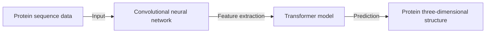

AlphaFold - A Milestone in AI

## TL;DR
AlphaFold is a revolutionary AI model that accurately predicts the three-dimensional structure of proteins.

## What is it
AlphaFold is a deep learning-based protein structure prediction model developed by Google's DeepMind research team. It uses a large amount of protein sequence and structure data for training and can predict the three-dimensional spatial structure of proteins. The name AlphaFold comes from an important concept in protein structure - the alpha helix.

## Why is it important
Protein structure prediction has been a long-standing challenge, and many scientists and researchers have attempted to solve this problem. The emergence of AlphaFold represents a major breakthrough in this field. It can help scientists better understand the function and behavior of proteins, driving progress in biomedicine and drug development.

## How it works
AlphaFold works on the principle of deep learning-based convolutional neural networks (CNNs) and transformer models. It first processes protein sequence data using CNNs and then uses the transformer model to predict the three-dimensional structure of proteins. AlphaFold's training data comes from the Protein Data Bank (PDB), a database containing a large amount of protein structure data.

## Differences from other protein structure prediction models
The main difference between AlphaFold and other protein structure prediction models lies in its accuracy and efficiency. AlphaFold uses a large amount of training data and advanced deep learning models to achieve higher prediction accuracy than other models. Additionally, AlphaFold can handle larger protein structures, making it more valuable for biomedical research and drug development.

## Summary
AlphaFold is a revolutionary AI model that accurately predicts the three-dimensional structure of proteins. It has significant implications for biomedical research and drug development, helping scientists better understand the function and behavior of proteins. The emergence of AlphaFold represents a major breakthrough in AI in the biomedical field.

## References
- Protein Data Bank (PDB): <https://www.rcsb.org/>