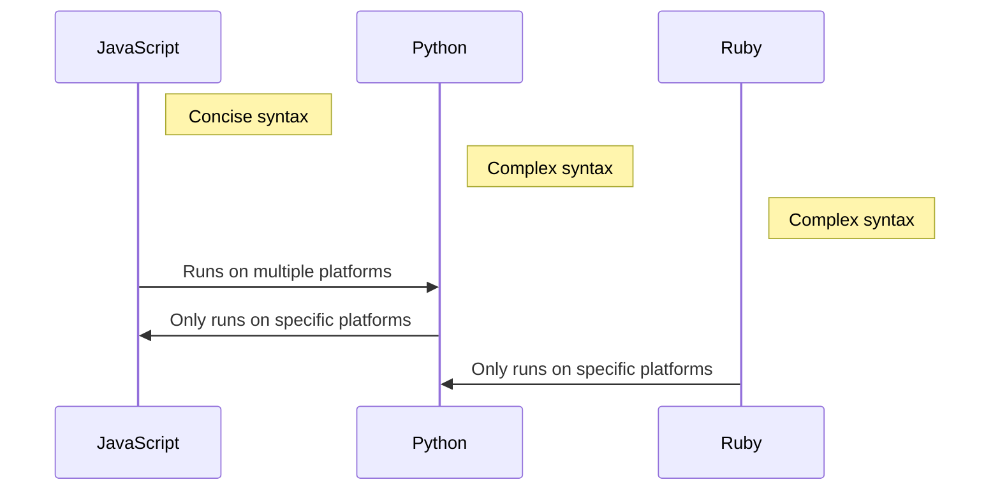

**Introduction**

Do you know how JavaScript evolved from a simple scripting language to the powerful tool it is today? In this article, we'll tell the story of a forgotten developer who helped transform JavaScript into the core technology of web development.

## TL;DR

JavaScript's savior: Brendan Eich.

## Who

Brendan Eich is an American programmer who created JavaScript in 1995. At the time, he was an employee at Netscape Communications, responsible for developing the scripting language for the Netscape Navigator browser. Initially, JavaScript was named "Mocha," but was later renamed to JavaScript to attract Java developers.

## Why It Matters

Brendan Eich's JavaScript solved a significant problem in web development: how to execute dynamic scripts on web pages. At the time, web development was mostly static, and updating content required server-side programming. JavaScript enabled developers to run scripts on the client-side, making dynamic web effects possible.

## How It Works

Brendan Eich designed JavaScript's syntax and semantics with the goal of creating a simple, easy-to-use language that non-professional programmers could use. JavaScript's syntax borrowed from C, Java, and Self, featuring a concise syntax and powerful functionality.

```mermaid
graph LR
    A[JavaScript] -->|inherits|> C[C]
    A -->|inherits|> Java
    A -->|inherits|> Self
    A -->|used in|> Netscape Navigator
```

## Comparison to Other Scripting Languages

Compared to other scripting languages, JavaScript's strengths lie in its concise syntax and powerful functionality. JavaScript's syntax is extremely simple and easy to learn, while also possessing strong functionality to handle complex tasks. Additionally, JavaScript is cross-platform, running on multiple platforms.



## Conclusion

Brendan Eich and his JavaScript created a new era in web development. JavaScript's concise syntax and powerful functionality have made it the core technology of web development today. If you're a web developer, you should thank Brendan Eich and his JavaScript.

## References

* [The forgotten developer who saved JavaScript...](https://www.youtube.com/watch?v=hu1K5TXROG4)