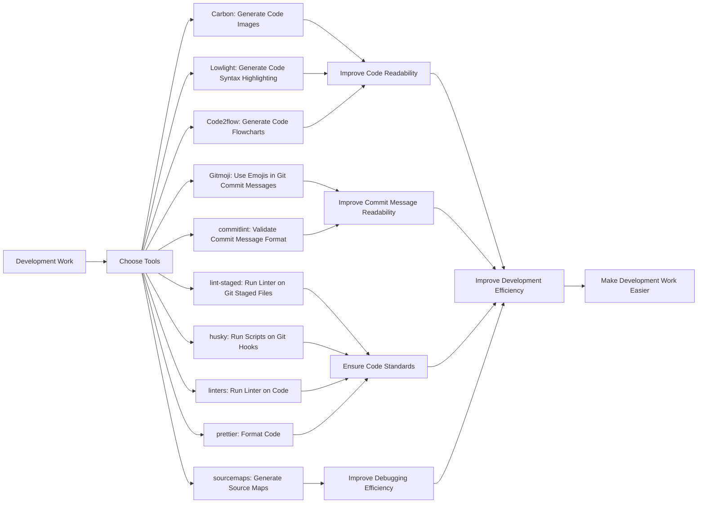

Here is the translated article:

## TL;DR
Explore unusual yet practical open source projects to boost your development efficiency.

## Unconventional Open Source Projects You Need Right Now
These unconventional open source projects can make your development work more efficient. Let's take a look at these practical tools.

## 1. **Carbon**: Generate Code Images
Carbon is a tool that converts code into images, making your code a beautiful picture. It supports multiple programming languages, including JavaScript, Python, Java, and more. You can use it to generate code screenshots, share with others, or use in documentation.

## 2. **Lowlight**: Generate Code Syntax Highlighting
Lowlight is a tool that generates code syntax highlighting, making your code easier to read. It supports multiple programming languages, including JavaScript, Python, Java, and more. You can use it to generate code syntax highlighting, improving code readability.

## 3. **Code2flow**: Generate Code Flowcharts
Code2flow is a tool that converts code into flowcharts, making your code a easy-to-understand diagram. It supports multiple programming languages, including JavaScript, Python, Java, and more. You can use it to generate code flowcharts, helping you better understand code logic.

## 4. **Gitmoji**: Use Emojis in Git Commit Messages
Gitmoji is a tool that allows you to use emojis in Git commit messages, making your commit messages more engaging. You can use it to add emojis to your commit messages, making them easier to read.

## 5. **commitlint**: Validate Commit Message Format
commitlint is a tool that validates commit message format, making your commit messages more standardized. You can use it to validate commit message format, ensuring your commit messages meet your team's standards.

## 6. **lint-staged**: Run Linter on Git Staged Files
lint-staged is a tool that runs linter on Git staged files, making your code cleaner. You can use it to run linter on Git staged files, ensuring your code meets your team's standards.

## 7. **husky**: Run Scripts on Git Hooks
husky is a tool that runs scripts on Git hooks, making your Git operations more automated. You can use it to run scripts on Git hooks, such as running linter or tests.

## 8. **linters**: Run Linter on Code
linters is a tool that runs linter on code, making your code cleaner. You can use it to run linter on code, ensuring your code meets your team's standards.

## 9. **prettier**: Format Code
prettier is a tool that formats code, making your code more readable. You can use it to format code, ensuring your code meets your team's standards.

## 10. **sourcemaps**: Generate Source Maps
sourcemaps is a tool that generates source maps, making your code easier to debug. You can use it to generate source maps, helping you debug code more efficiently.

## Summary
These unconventional open source projects can make your development work more efficient, improving code readability and maintainability. Choose the tools that suit you, and make your development work easier.

## References
* [10 weird OSS projects you need right now...](https://www.youtube.com/watch?v=H4CKuUNdkA0)

## Technical Architecture Diagram

