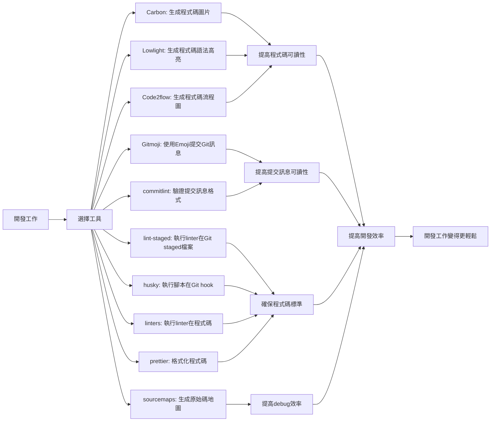

## TL;DR
探索那些不尋常卻實用的開源專案，讓你的開發工作更有效率。

## Unconventional Open Source Projects You Need Right Now
這些不尋常的開源專案能夠讓你的開發工作更有效率，讓我們來看看這些實用的工具。

## 1. **Carbon**: 生成程式碼的圖片
 Carbon 是一個可以將程式碼轉換成圖片的工具，讓你的程式碼變成一幅美麗的圖畫。它支持多種程式語言，包括 JavaScript、Python、Java 等，你可以使用它來生成程式碼的截圖，分享給他人或者用於文檔。

## 2. **Lowlight**: 生成程式碼的語法高亮效果
 Lowlight 是一個可以生成程式碼語法高亮效果的工具，讓你的程式碼變得更容易閱讀。它支持多種程式語言，包括 JavaScript、Python、Java 等，你可以使用它來生成程式碼的語法高亮效果，提高程式碼的可讀性。

## 3. **Code2flow**: 生成程式碼的流程圖
 Code2flow 是一個可以將程式碼轉換成流程圖的工具，讓你的程式碼變成一幅易於理解的流程圖。它支持多種程式語言，包括 JavaScript、Python、Java 等，你可以使用它來生成程式碼的流程圖，幫助你更好地理解程式碼的邏輯。

## 4. **Gitmoji**: 使用 Emoji 來提交 Git 訊息
 Gitmoji 是一個可以使用 Emoji 來提交 Git 訊息的工具，讓你的提交訊息變得更生動有趣。你可以使用它來添加 Emoji 到你的提交訊息中，讓你的提交訊息變得更容易閱讀。

## 5. **commitlint**: 驗證提交訊息的格式
 commitlint 是一個可以驗證提交訊息格式的工具，讓你的提交訊息變得更標準化。你可以使用它來驗證提交訊息的格式，確保提交訊息符合你的團隊的標準。

## 6. **lint-staged**: 執行 linter 在 Git staged 檔案上
 lint-staged 是一個可以執行 linter 在 Git staged 檔案上的工具，讓你的程式碼變得更乾淨。你可以使用它來執行 linter 在 Git staged 檔案上，確保你的程式碼符合你的團隊的標準。

## 7. **husky**: 執行腳本在 Git hook 上
 husky 是一個可以執行腳本在 Git hook 上的工具，讓你的 Git 操作變得更自動化。你可以使用它來執行腳本在 Git hook 上，例如執行 linter、執行測試等。

## 8. **linters**: 執行 linter 在程式碼上
 linters 是一個可以執行 linter 在程式碼上的工具，讓你的程式碼變得更乾淨。你可以使用它來執行 linter 在程式碼上，確保你的程式碼符合你的團隊的標準。

## 9. **prettier**: 格式化程式碼
 prettier 是一個可以格式化程式碼的工具，讓你的程式碼變得更易於閱讀。你可以使用它來格式化程式碼，確保你的程式碼符合你的團隊的標準。

## 10. **sourcemaps**: 生成原始碼地圖
 sourcemaps 是一個可以生成原始碼地圖的工具，讓你的程式碼變得更容易 debug。你可以使用它來生成原始碼地圖，幫助你更好地 debug 程式碼。

## 總結
這些不尋常的開源專案可以讓你的開發工作更有效率，提高程式碼的可讀性和可維護性。選擇適合你的工具，讓你的開發工作變得更輕鬆。

## 參考資料
* [10 weird OSS projects you need right now...](https://www.youtube.com/watch?v=H4CKuUNdkA0)

## 技術結構圖

- [10 weird OSS projects you need right now...](https://www.youtube.com/watch?v=qPuzWFvRajk)