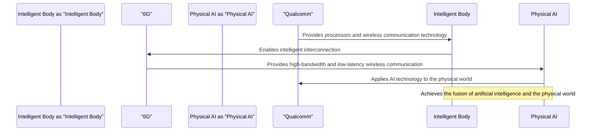

Conversing with Qualcomm: The Big Winner Behind the Explosions of Intelligent Bodies, 6G, and Physical AI

## TL;DR
Understand Qualcomm's strategic layout and innovative applications in the fields of intelligent bodies, 6G, and Physical AI.

## What is it
Qualcomm is a leading wireless technology company that has been actively deploying intelligent bodies, 6G, and Physical AI in recent years. Intelligent bodies refer to intelligent devices with perception, decision-making, and action capabilities. 6G is the next-generation wireless communication technology, and Physical AI is a research field that applies AI technology to the physical world.

## Why is it important
Qualcomm's deployment in the fields of intelligent bodies, 6G, and Physical AI will bring revolutionary changes to future wireless communication and AI applications. Intelligent bodies will make it more convenient for devices to interconnect, 6G will provide faster and more stable wireless communication experiences, and Physical AI will enable AI technology to be better applied in actual scenarios.

## How does it work
Qualcomm's intelligent body technology is based on its advanced processors and wireless communication technology, enabling intelligent interconnection between devices. 6G technology is based on millimeter wave and Terahertz frequency bands, providing higher bandwidth and lower latency. Physical AI technology is based on Qualcomm's AI engine and perception technology, enabling AI applications in the physical world.

## Differences from other companies
The difference between Qualcomm and other companies lies in its comprehensive deployment and innovative applications in the fields of intelligent bodies, 6G, and Physical AI. Qualcomm's technology and products cover the entire industry chain from intelligent bodies to 6G and Physical AI, providing users with a one-stop solution.

## Summary
Qualcomm's intelligent body, 6G, and Physical AI technologies and products are suitable for users who need advanced wireless communication and AI applications, especially in fields such as smart homes, smart cities, and industrial Internet.

## References
Conversing with Qualcomm: The Big Winner Behind the Explosions of Intelligent Bodies, 6G, and Physical AI