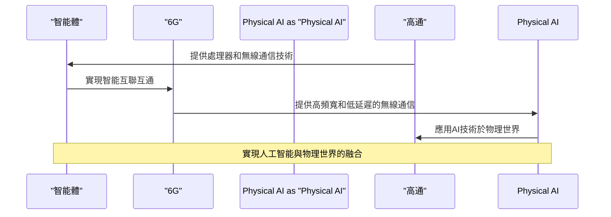

對話高通：智能體爆發、6G與Physical AI背後的大贏家

## TL;DR
了解高通在智能體、6G和Physical AI領域的戰略布局和創新應用。

## 是什麼
高通是一家領先的無線技術公司，近年來積極布局智能體、6G和Physical AI等領域。智能體是指具有感知、決策和行動能力的智能設備，6G是下一代無線通信技術，Physical AI是指將AI技術應用於物理世界的研究領域。

## 為什麼重要
高通在智能體、6G和Physical AI領域的布局，將為未來的無線通信和AI應用帶來革命性的變革。智能體將使得設備之間的互聯互通更加便捷，6G將提供更快、更穩定的無線通信體驗，Physical AI將使得AI技術更好地應用於實際場景。

## 怎麼運作
高通的智能體技術是基於其先進的處理器和無線通信技術，能夠實現設備之間的智能互聯互通。6G技術則是基於毫米波和 Terahertz 頻段，能夠提供更高的頻寬和更低的延遲。Physical AI技術則是基於高通的AI引擎和感知技術，能夠實現AI在物理世界中的應用。

## 跟其他公司的差別
高通與其他公司的差別在於其在智能體、6G和Physical AI領域的全面布局和創新應用。高通的技術和產品覆蓋了從智能體到6G再到Physical AI的整個產業鏈，為用戶提供了一站式的解決方案。

## 小結
高通的智能體、6G和Physical AI技術和產品，適合於需要先進無線通信和AI應用的用戶，特別是在智能家居、智能城市和工業互聯網等領域。

## 參考資料
對話高通：智能體爆發、6G與Physical AI背後的大贏家
- [对话高通：智能体爆发、6G与Physical AI背后的大赢家](https://www.youtube.com/watch?v=eAYx6CHstNw)